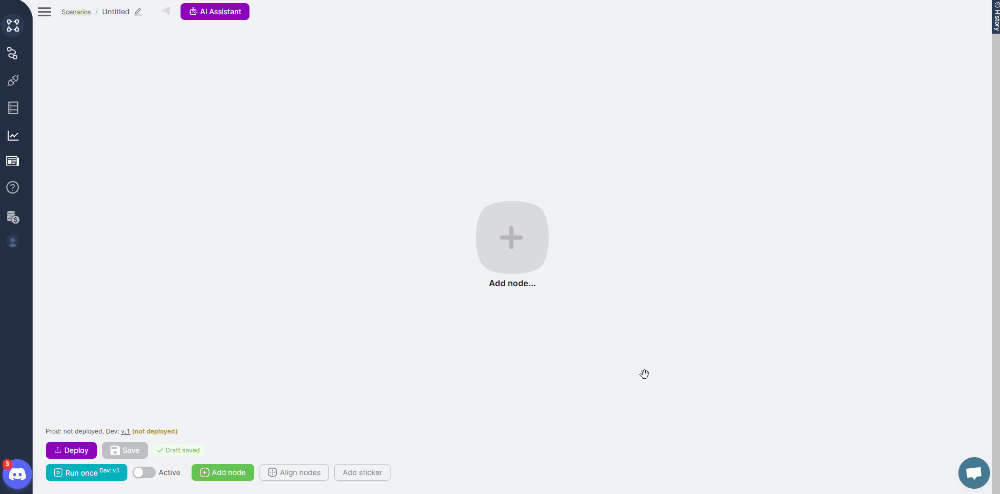
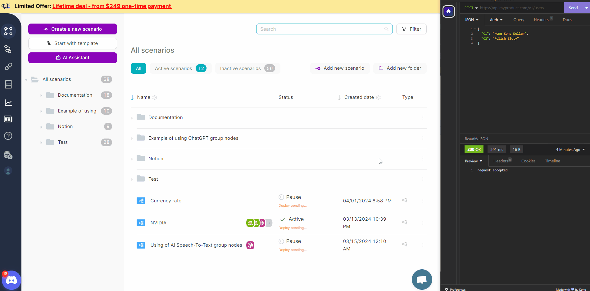

This section introduces you to the **Latenode** platform, which enables you to automate functions and build new logic using ready-made integrations with services that provide APIs. Alongside No-code automation, you can also write your own code with the help of an AI assistant.

In this section, you will create an algorithm to process a website with exchange rates based on requested data, save the found information, and email it to users.

Table of contents:

1. **Basic concepts and principles of platform operation**
2. **Creating a scenario**
3. **Run the scenario and view the results**

---

## 1. Basic concepts and principles of platform operation

## Principles of API operation

Most services offer APIs that allow you to retrieve data or perform specific functions. The concept of using APIs involves two services or applications communicating by sending requests and receiving responses.

The Latenode platform can send requests to multiple third-party services or applications. For example, you can configure Gmail to send emails to users with just a few clicks. The email parameters can be customized, and the content can be generated directly within **Latenode**.

## Scenario as a Method of Automation

The mechanism or algorithm that automates a function is called a [scenario](#broken-link-was-here). It consists of sequentially arranged [nodes](#broken-link-was-here) and [routes](#broken-link-was-here) connecting these nodes. Each node performs a specific action, such as running the scenario, processing or saving data, or sending a request with specified parameters to a third-party service. A node performs its action only after the previous node has completed its task. Additionally, nodes can use data generated or received by the previous nodes.


Nodes are categorized into two groups:

- **Trigger** nodes initiate the scenario. Depending on the type of node, it can be triggered by a button, when data is passed to the scenario, or on a schedule.


- **Action** nodes directly perform specific functions, such as storing or processing data or sending API requests to selected services.


## Trigger Nodes and Data Transfer to the Scenario

Trigger nodes can be divided into two groups, but all are used to start a scenario in some way.

The first group includes non-specific trigger nodes:

- The [Trigger on Webhook](#broken-link-was-here) node allows you to run the scenario by sending requests to this node. The request may contain data for other nodes in the scenario to use. In the example below, the scenario is triggered by [sending JSON](#broken-link-was-here) with the Value parameter to the [Trigger on Webhook](#broken-link-was-here) node. The values of the Value parameter are written to the global variable GlVar using the [SetGlobalVariables](#broken-link-was-here) node. The value of this variable is then returned by the [Webhook Response](#broken-link-was-here) node as the outcome of the scenario execution. Once the scenario is set to active (by toggling the Active switch at the bottom of the interface), it is possible to send requests without first clicking the **Run Once** button.


- The [Trigger on Run Once](#broken-link-was-here) node is useful for testing a scenario and allows you to run it by clicking the **Run once** button. Data transfer to the scenario using this node is not available, and it is not necessary to set the scenario to active status.


- The [Trigger on Schedule](#broken-link-was-here) node allows you to run the scenario on a schedule at the desired time. 
Data transfer to the scenario using this node is not available. The node settings allow you to define the schedule and timezone. To ensure the scenario runs according to the set schedule, expand the scenario in Prod using the expand button and ensure it is in active status.


The second group consists of application and service trigger nodes. For example, the **New or Modified Files** node triggers a scenario when a file is modified or a new file is added to Google Drive. The **New Message In Channel** node triggers a scenario when a message is sent to a specified Discord channel. These nodes also require authorization settings.

## Action Nodes for Performing Functions

**Action** nodes are further divided into two groups. The first group includes system nodes that perform standard actions. Examples of such nodes include:

- The [JavaScript](#broken-link-was-here) node for processing data or performing other functions using [JavaScript code](#broken-link-was-here). An AI assistant is built into this node to help generate the required code. You can ask the assistant to write or tweak the code and correct it as many times as necessary to achieve the desired result.



- The [SetGlobalVariables](#broken-link-was-here), [GetGlobalVariables](#broken-link-was-here), [SetVariables](#broken-link-was-here), and [GetVariables](#broken-link-was-here) nodes for saving received or generated data into variables and retrieving them. Any variable created is available for use in the next node and throughout the scenario. Global variables can also be used in other scenarios.


- The [Wait](#broken-link-was-here) node allows you to pause scenario execution for a specified period.


- The [Headless Browser](#broken-link-was-here) node is used for parsing websites and will be discussed further below.

The second group of nodes consists of specific nodes tailored to particular applications or services, each providing a distinct function. Typically, configuring these nodes requires filling in a few simple 
parameters. For example, the **Send Mail** node sends an email with the specified content to a given address, while the **Create Single Record or Update** node writes or updates a row in the desired AirTable. These nodes often require authorization setup.

## Using Code in Nodes

The **Latenode** platform supports executing functions using JavaScript code. Several nodes allow you to input or generate the code you need. The first is the [JavaScript](#broken-link-was-here) node, which includes an AI assistant. You can write code in this node yourself or with the assistant's help. By asking the assistant a question, you can get the code that performs a specific function and store it in the node.

The second is the [Headless Browser](#broken-link-was-here) node, which allows you to analyze website data according to the node's code.

## 2. Creating a scenario

## **Creating a Scenario and Adding Nodes**

To start automating a function, you need to add a new scenario. All created scenarios are available for viewing and managing on a separate interface. Each scenario has a menu that allows you to, for example, activate the scenario without opening it.


Once a scenario is created, nodes can be added by selecting them from the list. Each added node will require customization, and all nodes must be connected via node connection points.


Nodes specific to certain applications and services also require [authorization](#broken-link-was-here). Authorization can be set up in the node itself or on the authorizations page by selecting the required service from the list.


As an example, let's create a scenario that analyzes a website's exchange rate page, searches for the desired exchange rate based on specified parameters, writes the found value into a variable, and sends the user an email with the required information.

## **Passing JSON to a Scenario: Trigger on Webhook Node with Postman/Insomnia**

To start any scenario, you must add a trigger node. In our example, we need a [Trigger on Webhook](#broken-link-was-here) node because the scenario requires passing data. The data will consist of two currency names, `C1` and `C2`. The scenario can transfer files or JSON objects. [Postman or Insomnia](#broken-link-was-here) can be used for data transfer. The address of the [Trigger on Webhook](#broken-link-was-here) node should be specified as the request address.

```jsx
{
  "C1": "Hong Kong Dollar",
  "C2": "Polish Zloty"
}
```




## Headless Browser Node and Site Parsing

To process a website page, you need to add a [Headless Browser](#broken-link-was-here) node and include code in the node. The result of this node's execution will be the current exchange rate for the specified currencies. The code will process the web page using the data passed to the [Trigger on Webhook](#broken-link-was-here) node**:**

```jsx
// Get currency codes from the data transmitted by node 1
const currencyCode1 = data["{{1.`body`.`C1`}}"]; // Variable for the first currency code
const currencyCode2 = data["{{1.`body`.`C2`}}"]; // Variable for the second currency code

// Set User-Agent to simulate browser requests
await page.setUserAgent('Mozilla/5.0 (X11; Linux x86_64) AppleWebKit/537.36 (KHTML, like Gecko) Chrome/78.0.3904.108 Safari/537.36');

// Go to the page with Bank of England exchange rates
await page.goto('https://www.bankofengland.co.uk/boeapps/database/Rates.asp?Travel=NIxIRx&into=GBP');

// Wait for the table with exchange rates to be loaded
await page.waitForXPath('//*[@id="editorial"]/table');

// Search for the element with the currency rate corresponding to the first code and get its value
const currency1Element = await page.waitForXPath(`//td[a[contains(@title, "${currencyCode1}")]]/following-sibling::td[1]`, {timeout: 30000});
var currency1 = await currency1Element.evaluate(el => el.textContent.trim());

// Search for the element with the currency rate corresponding to the second code and get its value
const currency2Element = await page.waitForXPath(`//td[a[contains(@title, "${currencyCode2}")]]/following-sibling::td[1]`, {timeout: 30000});
var currency2 = await currency2Element.evaluate(el => el.textContent.trim());

// Build a JSON object with the desired structure
const result = {
    C1: `${currency1}`,
    C2: `${currency2}`
};

// Return this object
return result;

```


To test the nodes, you can launch them individually. This will execute the node with the specified parameters (including known data from previous nodes) and display an information message with the results in the upper right corner of the node.

## Creating Global Variables

Often, the data received in nodes needs to be saved. The **Latenode** platform allows you to save data in two types of variables. The first type, [global variables](#broken-link-was-here), allows data to be used by other scenarios. The second type, [local variables](#broken-link-was-here), restricts the use of data to the scenario in which it was obtained.

You can manage [variables](#broken-link-was-here) or [global variables](#broken-link-was-here) using special nodes or JavaScript code in the [Headless Browser](#broken-link-was-here) or [JavaScript](#broken-link-was-here) nodes.

For global variables, an [interface](#broken-link-was-here) for creating and editing variables is also available. Let's create global variables `C1` and `C2` and set their initial values. You can update these values with actual data later in the scenario.


## JavaScript Node and Data Processing with Code

The [JavaScript](#broken-link-was-here) node can be used to process data. For example, you can compare the values obtained from the [Headless Browser](#broken-link-was-here) node with the values of the global variables you created. Calculate the difference and generate a message based on the results. The message text will vary depending on whether the exchange rate has risen or fallen. You can use the following code:

```jsx
export default async function run({execution_id, input, data, store}) {
    // Get global variables
    const globalC1 = await store.getGlobalVariable('C1');
    const globalC2 = await store.getGlobalVariable('C2');

    // Get parameters from the Headless browser node
    const nodeC1 = data["{{$2.C1}}"];
    const nodeC2 = data["{{$2.C2}}"];

    // Get currency names
    const nameC1 = data["{{$1.body.C1}}"];
    const nameC2 = data["{{$1.body.C2}}"];
    
    // Convert values to numeric format
    const globalC1Number = parseFloat(globalC1);
    const globalC2Number = parseFloat(globalC2);
    const nodeC1Number = parseFloat(nodeC1);
    const nodeC2Number = parseFloat(nodeC2);
    
    // Compare the values modulo and calculate the difference between the variable value and the Headless browser node data
    const diffGlobalC1NodeC1 = Math.abs(globalC1Number - nodeC1Number).toFixed(4);
    const diffGlobalC2NodeC2 = Math.abs(globalC2Number - nodeC2Number).toFixed(4);
    
    let messageC1;
    
    if (globalC1Number - nodeC1Number < 0) {
        messageC1 = `The currency rate of ${nameC1} has increased by ${diffGlobalC1NodeC1} and is ${nodeC1}.`;
    } else if (globalC1Number - nodeC1Number === 0) {
        messageC1 = `The currency rate of ${nameC1} has not changed and is ${nodeC1}.`;
    } else {
        messageC1 = `The currency rate of ${nameC1} has fallen by ${diffGlobalC1NodeC1} and is ${nodeC1}.`;
    }
    
    let messageC2;
    
    if (globalC2Number - nodeC2Number < 0) {
        messageC2 = `The currency rate of ${nameC2} has increased by ${diffGlobalC2NodeC2} and is ${nodeC2}.`;
    } else if (globalC2Number - nodeC2Number === 0) {
        messageC2 = `The currency rate of ${nameC2} has not changed and is ${nodeC2}.`;
    } else {
        messageC2 = `The currency rate of ${nameC2} has fallen by ${diffGlobalC2NodeC2} and is ${nodeC2}.`;
    }
    
// Separate the sentences with a dot and start the second sentence on a new line    
return {
        message: messageC1 + " \n" + messageC2
    }
}
```


## Saving Data in Global Variables

We previously created two global variables, `C1` and `C2`, which contain exchange rate data. This data can be updated daily, and our scenario involves comparing the new data with the previous values. Therefore, each time we receive an update, we need to save the values in the `C1` and `C2` variables again. This can be done directly in the scenario using the [SetGlobalVariables](#broken-link-was-here) node. This node allows both the creation of new variables and the overwriting of existing variable values.


## Using APP Nodes and Authorization

App nodes can be used to perform specific functions. An example is the **Send Mail** node, which sends an email to a specified address. Often, using these nodes requires setting up [authorization](#broken-link-was-here), allowing the **Latenode** platform to access the necessary functions.


## 3. Run the scenario and view the results

## Single Scenario Run and Run History

When developing a scenario, you can run it once to test the node settings. In this case, the scenario will execute once and then terminate. The [Trigger on Run Once](#broken-link-was-here) node can be helpful for this, initiating scenario execution with the **Run once** button.

Each scenario run is saved in the [history](#broken-link-was-here). The history table shows the status of the run, the number of operations performed, and the run time. In addition to basic scenario information, you can view the nodes, their settings, and connections used during the run. This includes the data used or generated by the nodes.

You can [copy the link to the scenario run](#broken-link-was-here), for example, to share it with the **Latenode** community for consultation.

The scenario run can be repeated with the same settings and data as the original run.


## Scenario Versions and Publishing to Prod

Each time you save a scenario, a new Dev [version](#broken-link-was-here) is created. Any Dev version can be published to Prod. Scenario versions are independent, allowing you to continue development while keeping the Prod version up-to-date.

The scenario version is important when sending a request to the [Trigger on Webhook](#broken-link-was-here) node, as this node has separate Dev and Prod addresses for sending requests and initiating the scenario.


## Errors During Scenario Execution

Errors can occur during scenario execution. They are displayed on the right side of the node where the error occurred. If the scenario did not complete successfully, the error will also be shown in the scenario run history.


