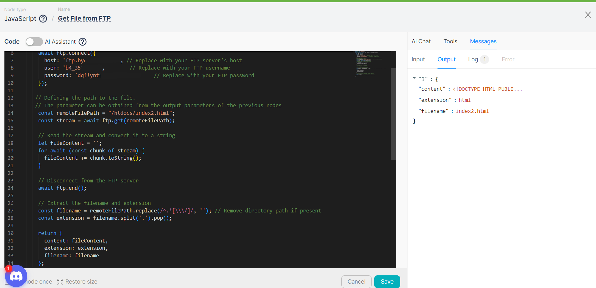
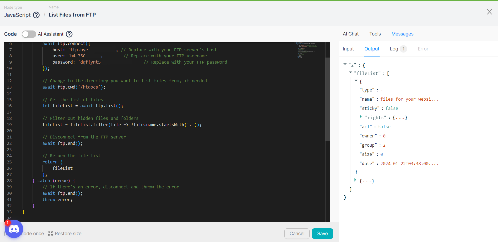
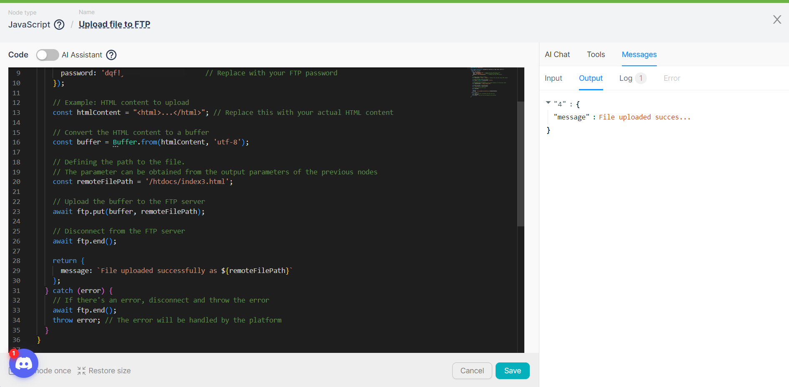
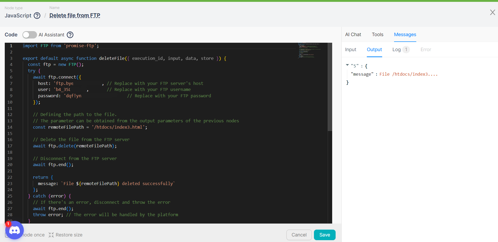

With the code generated in the **JavaScript** node, file management on an FTP server is possible. For a specific directory on the designated FTP server, the following actions are available:

- Retrieving a list of files.
- Retrieving a file, including its content.
- Uploading a file.
- Deleting a file.

## **Retrieving files**

To ***retrieve*** a file using the **JavaScript** node, follow these steps:

1. Add a **JavaScript** node to the script with the following code:

```jsx
import FTP from 'promise-ftp';

export default async function run({ execution_id, input, data, store }) {
  const ftp = new FTP();
  try {
    await ftp.connect({
      host: 'You_host', // Replace with your FTP server's host
      user: 'You_login',        // Replace with your FTP username
      password: 'You_password'     // Replace with your FTP password
    });

   // Defining the path to the file.
   // The parameter can be obtained from the output parameters of the previous nodes
    const remoteFilePath = "/htdocs/index2.html";
    const stream = await ftp.get(remoteFilePath);

    // Read the stream and convert it to a string
    let fileContent = '';
    for await (const chunk of stream) {
      fileContent += chunk.toString();
    }

    // Disconnect from the FTP server
    await ftp.end();

    // Extract the filename and extension
    const filename = remoteFilePath.replace(/^.*[\\\/]/, ''); // Remove directory path if present
    const extension = filename.split('.').pop();

    return {
      content: fileContent,
      extension: extension,
      filename: filename
    };
  } catch (error) {
    // If there's an error, disconnect and throw the error
    await ftp.end();
    throw error; // The error will be handled by the platform
  }
}
```

This code contains a function to connect to the FTP server with specified credentials, retrieve the content of the file from the given path **`remoteFilePath`**, read the file, extract its name **`filename`**, and extension **`extension`**, and return this data. In case of an error, the code disconnects from the FTP server and passes the error for platform handling.

2. Run the **JavaScript** node once and wait for its execution;

3. Examine the **JavaScript** node's output data for file attributes, including its content:



## **Retrieving a list of files**

To ***retrieve a list*** of files using the **JavaScript** node, follow these steps:

1. Add a **JavaScript** node to the script with the following code: 

```jsx
import FTP from 'promise-ftp';

export default async function run({execution_id, input, data, store}) {
    const ftp = new FTP();
    try {
        await ftp.connect({
      host: 'You_host', // Replace with your FTP server's host
      user: 'You_login',        // Replace with your FTP username
      password: 'You_password'     // Replace with your FTP password
        });

        // Change to the directory you want to list files from, if needed
        await ftp.cwd('/htdocs');

        // Get the list of files
        let fileList = await ftp.list();

        // Filter out hidden files and folders
        fileList = fileList.filter(file => !file.name.startsWith('.'));

        // Disconnect from the FTP server
        await ftp.end();
        
        // Return the file list
        return {
            fileList
        };
    } catch (error) {
        // If there's an error, disconnect and throw the error
        await ftp.end();
        throw error;
    }
}
```

This code connects to the FTP server, changes the working directory to **`/htdocs`** (if necessary), retrieves the list of files, excludes hidden files and folders, and then returns this list **`fileList`**. In case of an error, the code disconnects from the FTP server and passes the error for platform handling.

2. Run the **JavaScript** node once and wait for its execution;

3. Examine the **JavaScript** node's output data, an array of files, including parameters for each file:

```jsx
{
"type": "-",
"name": "index2.html",
"sticky": false,
"rights": {
"user": "rw",
"group": "r",
"other": "r"
},
"acl": false,
"owner": "0",
"group": "2",
"size": 2064,
"date": "2024-01-22T03:38:00.000Z"
}
```



## **Uploading a file**

To ***upload*** a file to an FTP server using the **JavaScript** node, follow these steps:

1. Add a **JavaScript** node to the script with the following code: 

```jsx
import FTP from 'promise-ftp';

export default async function uploadFile({ execution_id, input, data, store }) {
  const ftp = new FTP();
  try {
    await ftp.connect({
      host: 'You_host', // Replace with your FTP server's host
      user: 'You_login',        // Replace with your FTP username
      password: 'You_password'     // Replace with your FTP password
    });

    // Example: HTML content to upload
    const htmlContent = "<html>...</html>"; // Replace this with your actual HTML content

    // Convert the HTML content to a buffer
    const buffer = Buffer.from(htmlContent, 'utf-8');

    // Defining the path to the file.
    // The parameter can be obtained from the output parameters of the previous nodes
    const remoteFilePath = '/htdocs/index3.html';

    // Upload the buffer to the FTP server
    await ftp.put(buffer, remoteFilePath);

    // Disconnect from the FTP server
    await ftp.end();

    return {
      message: `File uploaded successfully as ${remoteFilePath}`
    };
  } catch (error) {
    // If there's an error, disconnect and throw the error
    await ftp.end();
    throw error; // The error will be handled by the platform
  }
}
```

This code is designed to connect to the FTP server, upload a file with HTML content **`htmlContent`**, and return a success message **`message`**. The file is created from HTML content and uploaded to the server at the specified path **`remoteFilePath`**. In case of an error during connection or upload, the connection to the server is closed, and the error is passed for platform handling.

2. Run the **JavaScript** node once and wait for its execution;

3. Examine the **JavaScript** node's output data for a successful upload message with the file location:



## **Deleting a file**

To ***delete*** a file from an FTP server using the **JavaScript** node, follow these steps: 

1. Add a **JavaScript** node to the script with the following code: 

```jsx
import FTP from 'promise-ftp';

export default async function deleteFile({ execution_id, input, data, store }) {
  const ftp = new FTP();
  try {
    await ftp.connect({
      host: 'You_host', // Replace with your FTP server's host
      user: 'You_login',        // Replace with your FTP username
      password: 'You_password'     // Replace with your FTP password
    });

    // Defining the path to the file.
    // The parameter can be obtained from the output parameters of the previous nodes
    const remoteFilePath = '/htdocs/index3.html';

    // Delete the file from the FTP server
    await ftp.delete(remoteFilePath);

    // Disconnect from the FTP server
    await ftp.end();

    return {
      message: `File ${remoteFilePath} deleted successfully`
    };
  } catch (error) {
    // If there's an error, disconnect and throw the error
    await ftp.end();
    throw error; // The error will be handled by the platform
  }
}
```

This code is designed to connect to an FTP server and delete a file located at the path specified in the variable **`remoteFilePath`**. After a successful connection, the code deletes the file from the server. If the file is successfully deleted, the function returns a `message` stating that the file has been removed. In case of an error during the connection or file deletion process, the server connection is closed, and the error is passed for handling by the platform.

2. Run the **JavaScript** node once and wait for its execution;

3. Examine the **JavaScript** node's output data for a successful file deletion message:

