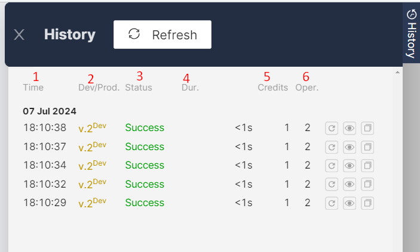
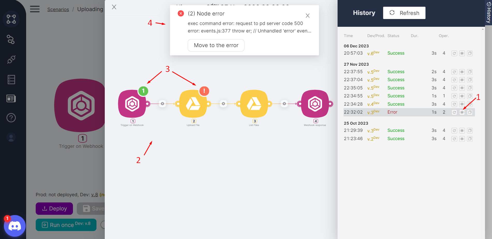
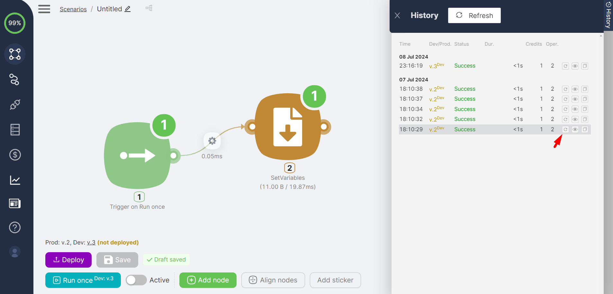

:::tip
💡 If the history table is empty, you need to run the scenario. For more details on running a scenario once, see the [Run once Scenario Execution](#broken-link-was-here) section.
:::

Every scenario run (successful or unsuccessful) is recorded in the history. The history table is accessible by clicking the **History** button. The table displays key information about the scenario:

- **(1)** Scenario start **time;**  
- **(2)** Branch **(Development or Production)** of the run scenario, including the version, e.g., v.13 Dev;  
- **(3)** Execution **status** of the scenario:  

**Success** if the scenario is fully completed  
**Error** if errors occurred during the scenario  
**Paused** if the scenario is in the execution stage of a Wait node  
**New** if the scenario was stopped by clicking the **Stop** button  

- **(4)** Scenario execution **duration** in seconds;  
- **(5)** Number of **credits** consumed by the scenario;  
- **(6)** Number of **operations** performed in the scenario.  

### Viewing a Scenario

For each scenario run entry, there is a **View** button. Clicking the **View** button **(1)** displays the nodes **(2)** and their notifications **(3)** for the selected version of the scenario. If the scenario ended with an error, error information is displayed **(4)**.  

### Restarting a Scenario

For each scenario run entry, there is a **Restart** button. Clicking the **Restart** button:  

- Initiates a rerun identical to the selected scenario version and input data  
- Creates a new history entry  

:::tip
💡 You can also [copy the scenario execution from the history](#broken-link-was-here).
:::
