To configure each node, you need to fill in its fields. The fields in scenario nodes can be populated with:

- Variables created within the scenario
- Global variables
- Output parameters from other nodes in the scenario

You can manually or automatically fill these node fields.

## Variables

Existing variables are displayed in a helper window for filling in node or route fields. To make a variable appear in the helper window, it must first be created:

- To create a "regular" variable for use in the scenario, add a [SetVariables](../%F0%9F%94%84%20Action%20&%20Trigger%20Nodes%2019157d45a0678059b6a0f0805c542f0a/SetVariables%2019757d45a06780cd8977f294d22b57a7.md) node and run it.
- To create a global variable, add a [SetGlobalVariables](../%F0%9F%94%84%20Action%20&%20Trigger%20Nodes%2019157d45a0678059b6a0f0805c542f0a/SetGlobalVariables%2019757d45a06780cb8bf8fabad09b8518.md) node (in the current or any other scenario) and run it. Another way to create global variables is to add them via a separate interface.


### Automatic Filling

To automatically fill a field with a variable:

- **(1)** Click on the node or route configuration field.
- **(2)** View the available parameters from previous nodes in the **Variables** window. The **Variables** tab displays both regular variables (added to the scenario using the [SetVariables](../%F0%9F%94%84%20Action%20&%20Trigger%20Nodes%2019157d45a0678059b6a0f0805c542f0a/SetVariables%2019757d45a06780cd8977f294d22b57a7.md) node) and global variables (added to the account using the [SetGlobalVariables](../%F0%9F%94%84%20Action%20&%20Trigger%20Nodes%2019157d45a0678059b6a0f0805c542f0a/SetGlobalVariables%2019757d45a06780cb8bf8fabad09b8518.md) node or manually).
- **(3)** Select the necessary regular or global variables.

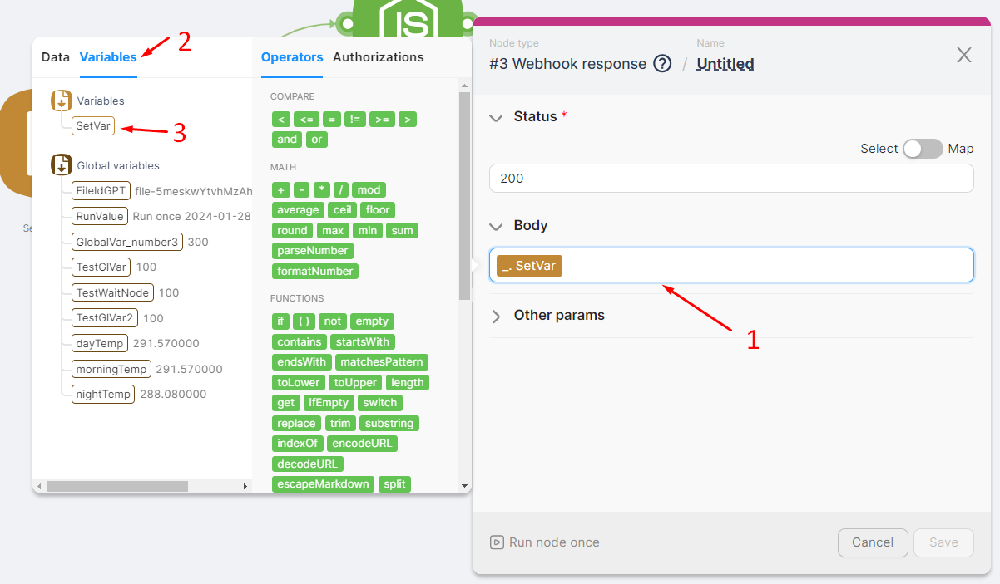

### Manual Filling

To manually fill a node field with variable values, write the variable name in curly braces in the specified format:

- For regular variables, use the format - **`{{_.VariableName}}`**.

***Example:*** Variable "SetVar" - **`{{_.SetVar}}`**

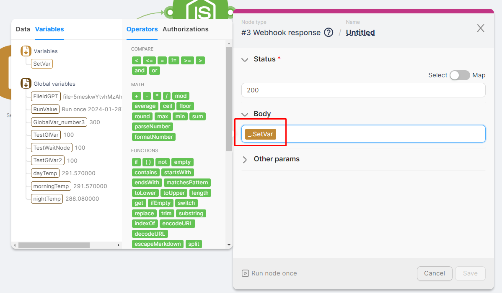

- For global variables, use the format - **`{{%.VariableName}}`**.

***Example:*** Variable "dayTemp" - **`{{%.dayTemp}}` .**

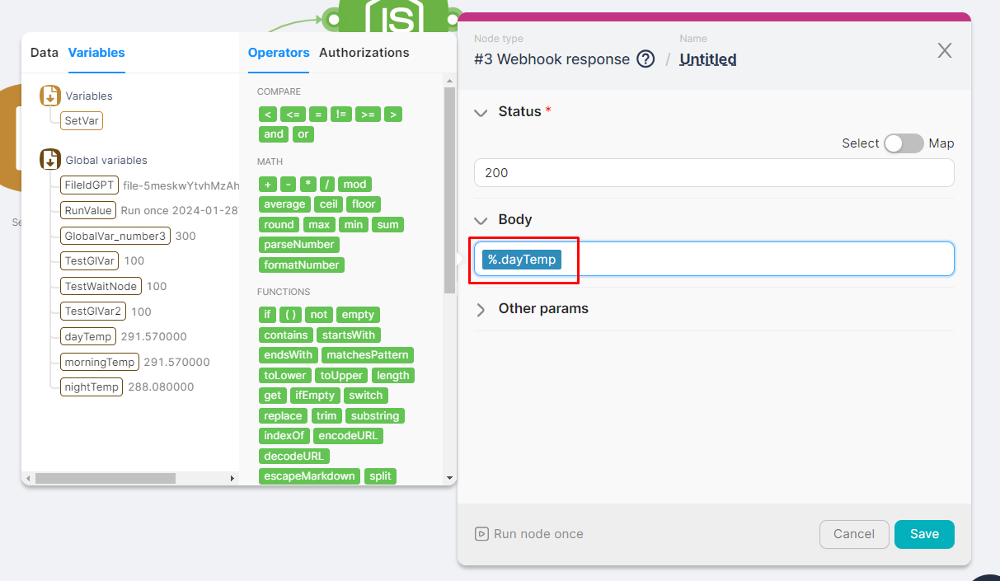

## Node Data

The output of previous nodes is displayed in a helper window for filling in node or route fields.

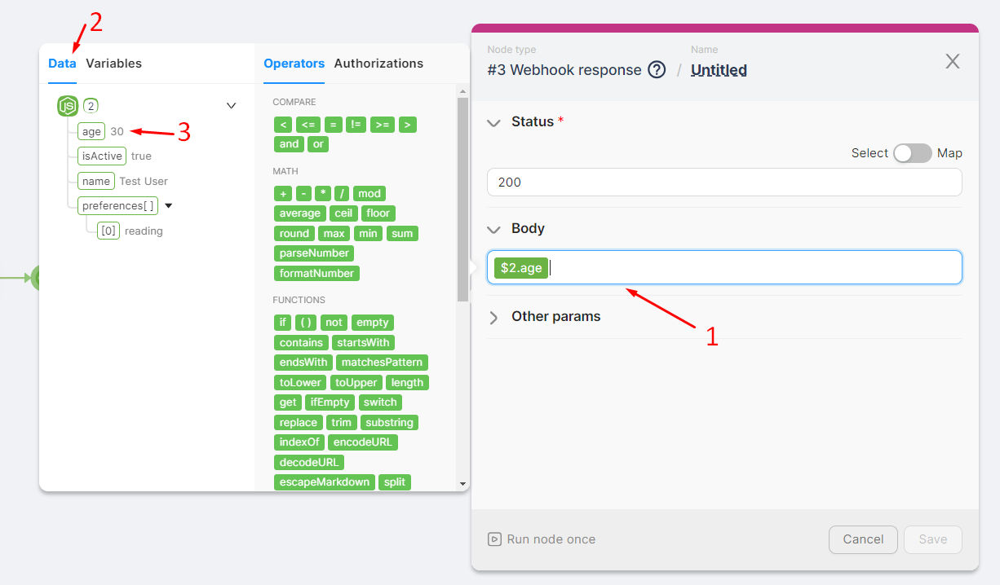

### Automatic Filling

To automatically input a parameter:

- **(1)** Click on the node or route configuration field.
- **(2)** View the available parameters from previous nodes in the **Data** window.
- **(3)** Select the necessary parameters or entire nodes.

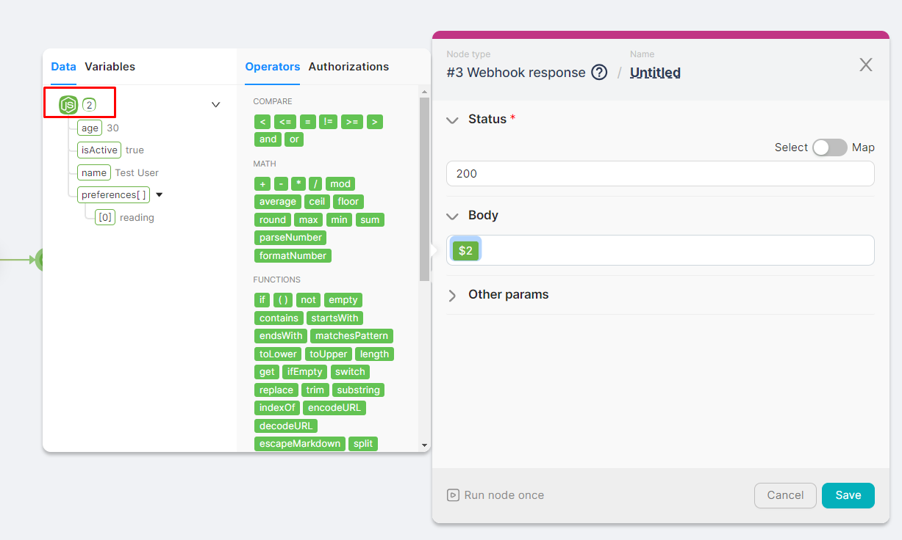

### Manual Filling

To manually fill a field with existing data, write the parameter name in curly braces in the specified format:

- **All data** from a node in the format - **`{{$NodeNumber}}`**.

***Example:*** Node 2 - **`{{$2}}`**

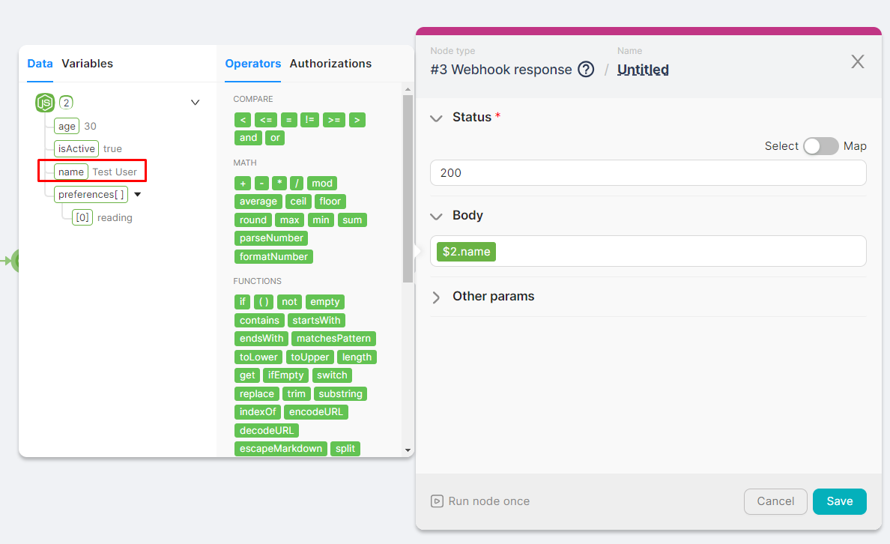

- **Specific parameter** in the format - **`{{$NodeNumber.ParameterPath.ParameterName}}`**.

***Example:*** Parameter “name” in node 2 - **`{{$2.name}}`**

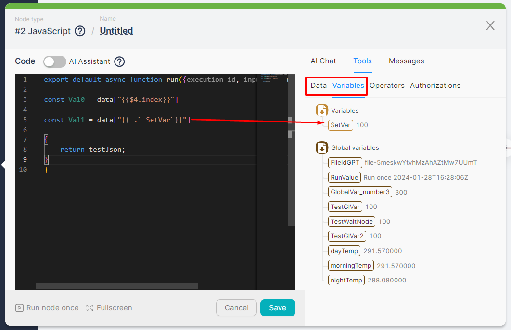

## JavaScript and Headless Browser

In both the **JavaScript** and **Headless Browser** nodes, you can select parameters from previous nodes or variables. For example, to easily create a constant in the **JavaScript** node:

- Write the expression to add the constant, such as `const =`.
- Select the necessary parameter from previous nodes.

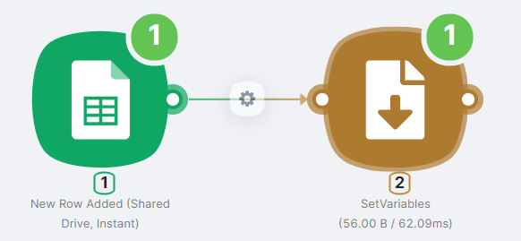

<aside>
⚠️ When adding data from other nodes, part of the expression might be wrapped in backticks, like this: `data["{{1.headers.Content-Type}}"]`, even though another node returned the property without them. You do not need to remove the backticks, as they will be ignored during code processing. Manually removing them may cause the code to fail.
</aside>

## Arrays

Sometimes, the output parameters of a node may be arrays containing a set of elements. You can use the desired array element or the entire array in other nodes.

### Auto-Filling

For example, let's create a scenario where the trigger node activates when a new row is added to a Google Sheet and provides an array of cell values from the new row as output parameters. We'll specify the entire array and individual elements as variables. To create this scenario, add two nodes:

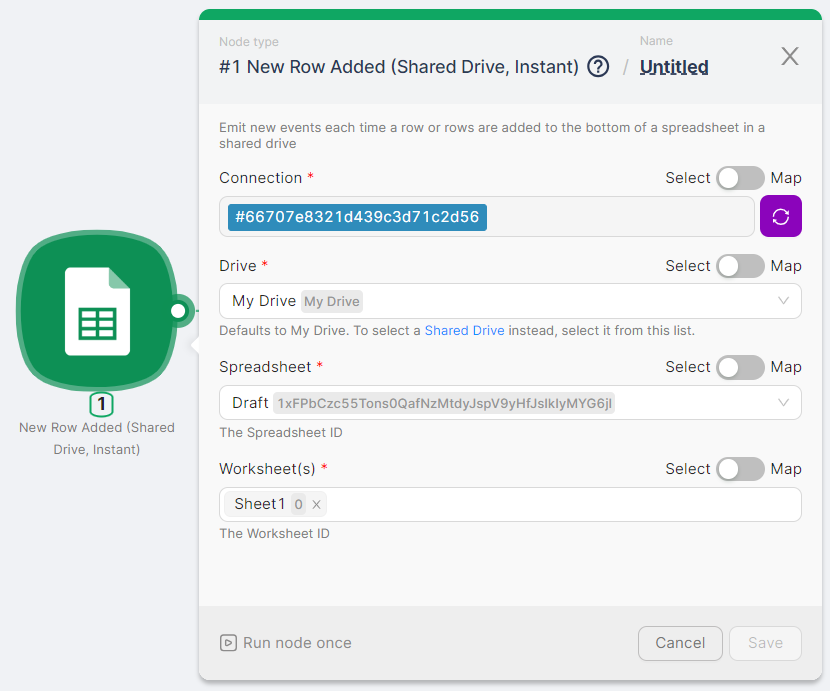

- **(1)** **New Row Added (Shared Drive, Instant)** - to trigger the scenario and provide data about the added row. Authorization and selection of the required table and sheet are necessary for this node.

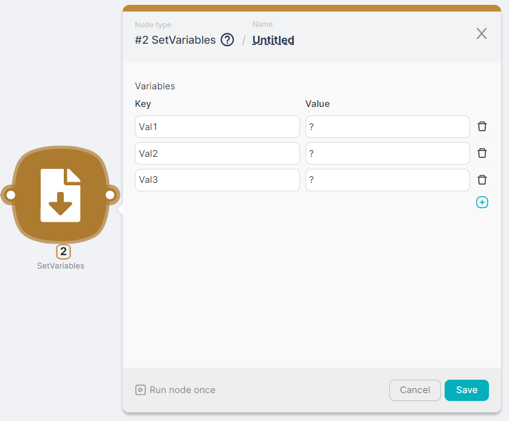

- **(2)** **SetVariables** - to record variables Val1, Val2, and Val3.

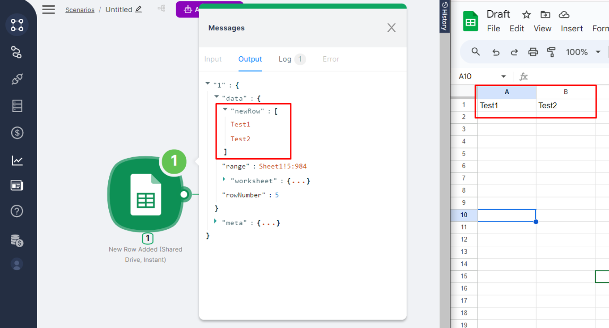

Run the scenario once by clicking the **Run Once** button and add a row to the specified table. The output of the **New Row Added (Shared Drive, Instant)** node will include an array of cell values from the added row:

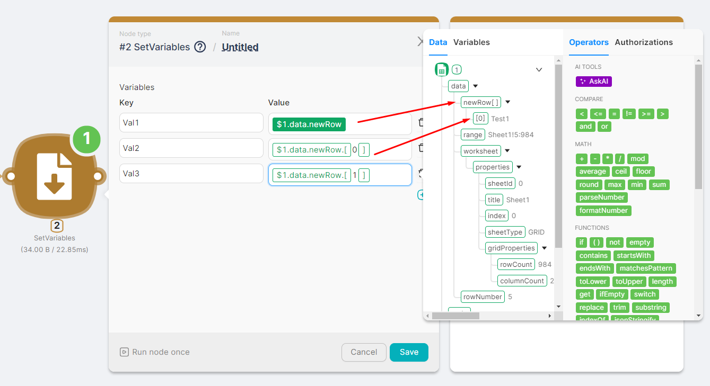

Set the variable values:

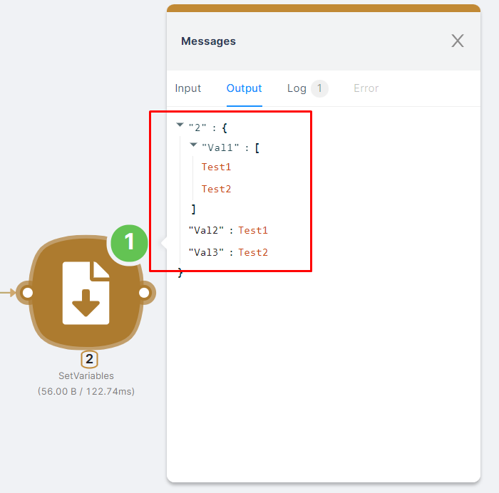

- Val1 - the entire array of values **`{{$1.data.newRow}}`**. Click on **`newRow[ ]`**.
- Val2 - the first element of the array **`{{$1.data.newRow.[`0`]}}`**. Click on **`[0]`**.
- Val3 - the second element of the array **`{{$1.data.newRow.[`1`]}}`**. Click on **`[0]`** and **manually replace 0 with 1.**

Run the **SetVariables** node once and check the recorded variable values. You can then use each of these variables to fill in the fields of other nodes in the Helper Widget.

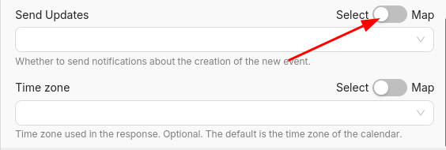

## Using the “Select/Map” toggle in the settings

Some parameters, such as a dropdown list or toggle, by default do not have an input field that allows passing data to the parameter from variables or previous nodes.

For such parameters, there is a special toggle:

When the toggle is set to "Select," the parameter operates in manual mode. In the case of a dropdown list, the item is selected manually and saved in the node settings.

For example, in Google Calendar, you can select rules for sending notifications about a new event:

In cases where notification sending needs to be managed dynamically, the toggle must be set to "Map" mode, and data from other nodes can be used:

---

In cases where notification sending needs to be managed dynamically, the toggle must be set to **“Map”**, and data from other nodes can be used:

This allows the value to change on each run based on scenario input — unlike **“Select”**, which always uses a fixed value chosen manually.

---

## Using the “Select / Map” Toggle in the Settings

Some parameters, such as a dropdown list or toggle, by default do not have an input field that allows passing data from variables or previous nodes.

For such parameters, there is a special toggle:

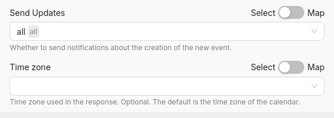

When the toggle is set to **“Select”**, the parameter operates in **manual (static)** mode. In the case of a dropdown list, the item is selected manually and saved in the node settings.

For example, in Google Calendar, you can select rules for sending notifications about a new event:

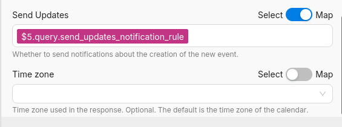

This value will always stay the same unless changed manually. It cannot be influenced by other nodes or incoming data.

> Use Select when the value should always remain fixed during scenario execution.

---

In cases where the value needs to be set dynamically, switch the toggle to **“Map”** mode. This allows passing data from previous nodes:

```

\$5.query.send\_updates\_notification\_rule
```

The value will now update automatically on each run, based on scenario input — for example, from a webhook, user form, or database.

> Use Map when the value should react to dynamic input from other nodes.

---

### Why Map Mode Is More Powerful

Unlike **Select**, which is limited to predefined values, **Map** mode enables:

- ✅ **Boolean values** like `true` / `false`  
- 🔧 **Dynamic formatting using [Operators](https://docs.latenode.com/docs/operators)**  

**Example:**

```

{{ if(7.is\_active = true; "Active"; "Inactive") }}
```

📢 **Explanation:**

- `7.is_active` — a variable from node 7, for example a boolean flag  
- `= true` — condition that checks if the flag is active  
- Returns `"Active"` if true, `"Inactive"` otherwise  

> ⚠️ This logic is only available in Map mode.  
> The **Select** mode does not support variables or expressions.
