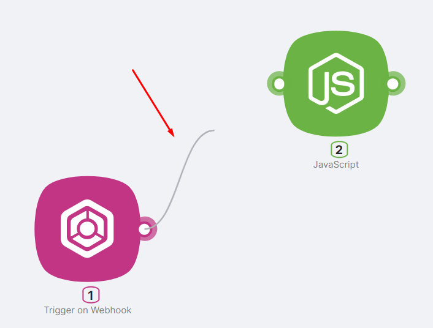
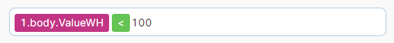
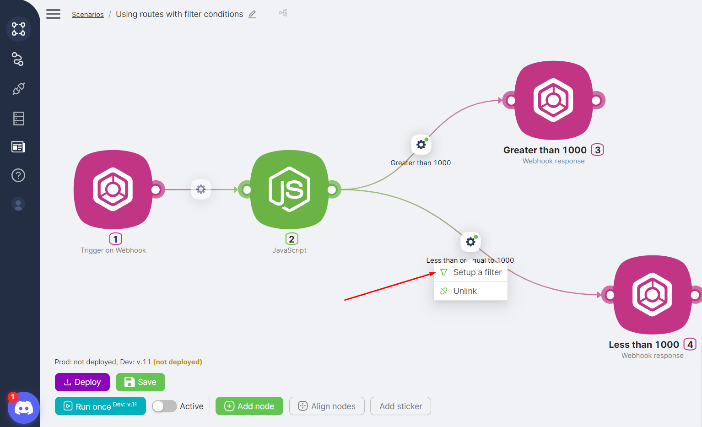
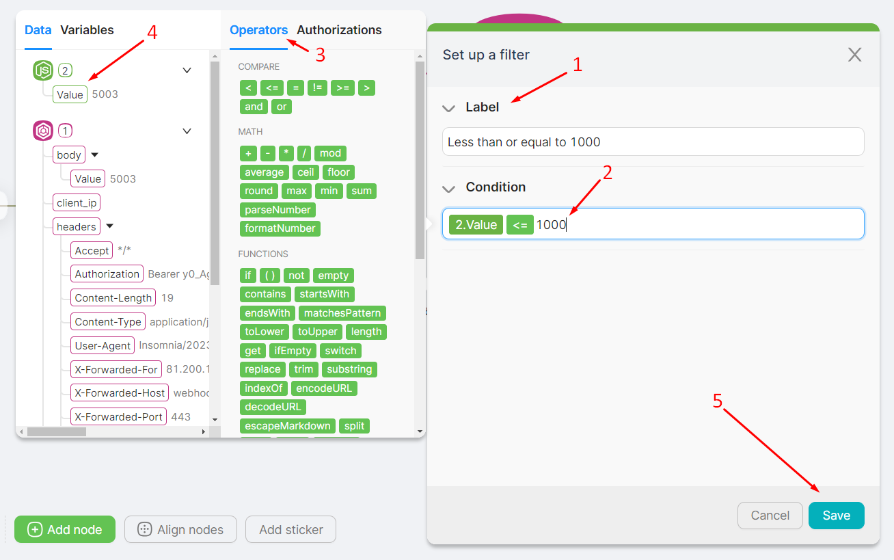

## Adding a Route

If a node is added through the **route point** of an existing node, a route between these nodes is established automatically.

If a node is added through the **Add Node** button, you should set up the route manually by connecting the two route points of the desired nodes in the correct direction.

## Route Configuration, Conditions

:::tip
 When there are multiple routes through which the scenario can proceed, the route with a value of **TRUE** in the **Condition** field will be chosen.
:::

**Example of a route** with a **Condition** value of **TRUE**:

- If 1.body.ValueWH = 45, then TRUE;  
- If 1.body.ValueWH = 125, then FALSE.  

After adding the **route**, you can access its settings by clicking the **Setup a filter** button.

In the **route** configuration window, you can:

- Change the route name in the **Name** field (**1**)  
- Enter filter conditions in the **Condition** field (**2**), selecting logical operators for expressions in the **Operators** window (**3**) and values/parameters from previous nodes in the **Data** window (**4**)  
- Save the changes by clicking the **Save** button (**5**)  

:::tip
 See also [Scenario example using conditions in routes](#broken-link-was-here)
:::

