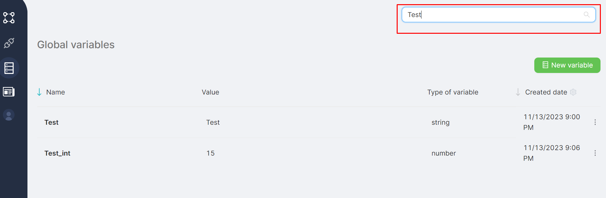

## Creating a global variable

To add a new global variable, click the **New Variable** button on the page listing global variables. 

After clicking the add button, a window for creating a global variable opens on the same page.

To create a variable, choose the variable type from the mandatory drop-down field **Select the type of variable** in the new variable window. The available values for selection are: string, number, JSON, and boolean.

### Variable Type - String, Number, JSON

If a variable of type string, number, or JSON is created, fill in the mandatory fields before clicking the **Save (4)** button:

- Variable name in the **Name (1)** field;  
- Variable value (up to 32Mb for strings and JSON) in the **Value (2)** field;  
- Indication of whether the variable can be edited from the scenario **(3)** (default - yes).  

### Variable Type - Boolean

If the created variable is of boolean type, fill in the mandatory fields before clicking the **Save (4)** button:

- Variable name in the **Name (1)** field;  
- One of the two possible values, true or false, for the variable in the **Value (2)** field;  
- Indication of whether the variable can be edited from the script **(3)** (default - yes).  

## Editing a global variable

To modify a global variable, click the **Edit (2)** button in the menu of the variable's row **(1)** in the global variables table.

After clicking the edit button, a window for changing the selected global variable opens on the same page. The variable parameters are filled in the corresponding fields and are available for modification.

## All Global Variables

Existing global variables are accessible for review on the **Global Variables** page in the corresponding table.

- (**1**) The name of the global variable is in the **Name** column;  
- (**2**) The value of the global variable is in the **Value** column. The maximum size of the variable's value (string or JSON) is **32MB;**  
- (**3**) The variable type is in the **Type of variable** column. Variables can be a string, number, JSON, or a boolean value (true/false);  
- (**4**) The creation date of the global variable is in the **Creation Date** column. Using the gear icon, the column can be reconfigured to display the modification date instead of the creation date;  

- Menu (**5**) available for each row allowing:  

**Edit** the global variable;  
**Delete** the global variable.  

:::tip
⚠️ Upon clicking the **Delete** button and confirming the action in the modal window, the variable will be permanently deleted.
:::

For ease of viewing and managing variables, a filter is available at the top of the global variables page. The test filter allows entering the desired variable name value.

