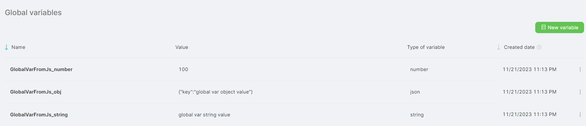
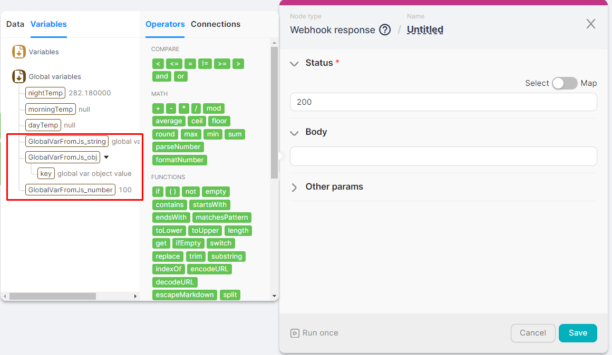
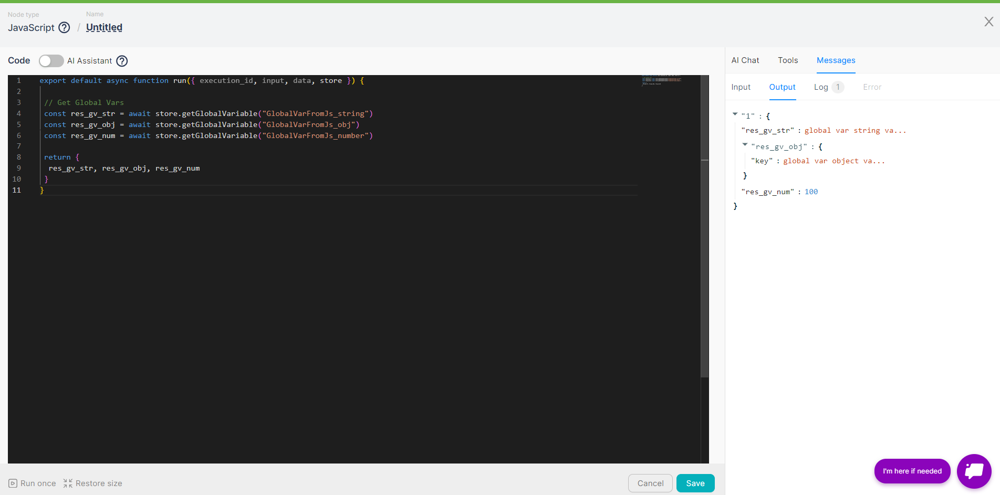
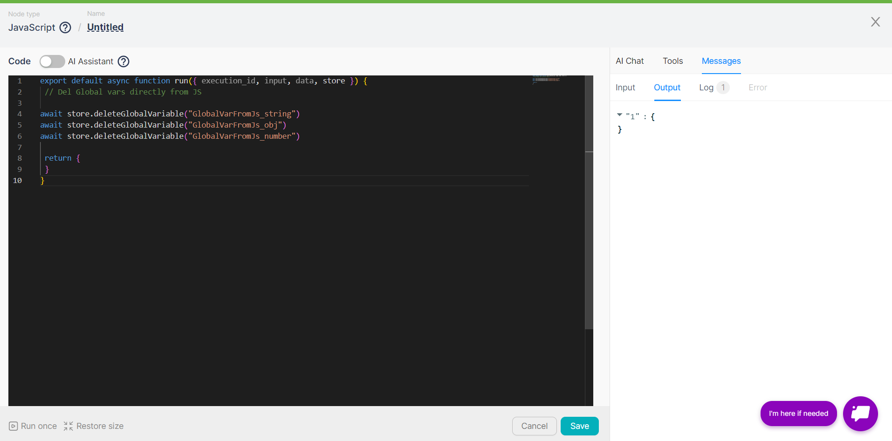
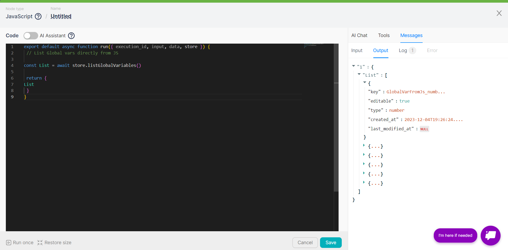

## Сreate Global Variables

To ***create*** a global variable using the **JavaScript** node, you need to:

1. Add a **JavaScript** node to the scenario with the following code: 

```jsx
export default async function run({ execution_id, input, data, store }) {
 // Set Global vars directly from JS
 // String, Obj and Number are available
 const gv_str = await store.setGlobalVariable("GlobalVarFromJs_string", "global var string value");
 const gv_obj = await store.setGlobalVariable("GlobalVarFromJs_obj", {"key":"global var object value"});
 const gv_num = await store.setGlobalVariable("GlobalVarFromJs_number", 100);

 return {
 }
}
````

This code represents an asynchronous function **`run`**. This function is intended for execution in a web automation scenario and uses objects **`execution_id`**, **`input`**, **`data`**, and **`store`**.

The function defines global variables **`GlobalVarFromJs_string`**, **`GlobalVarFromJs_obj`**, **`GlobalVarFromJs_number`** and saves them using the **`store.setGlobalVariable`** method. These global variables can be used later in other nodes of the scenario.

2. Run the **JavaScript** node once and wait for its execution.
3. View the globally created variables **`GlobalVarFromJs_string`**, **`GlobalVarFromJs_obj`**, **`GlobalVarFromJs_number`** on the **Global variables** interface.



4. Check for the presence of new global variables when filling in the parameters of any other node:



## Getting Global Variables

To ***get*** a global variable using a **JavaScript** node, you need to:

1. Add a **JavaScript** node to the scenario with the following code:

```jsx
export default async function run({ execution_id, input, data, store }) {

 // Get Global Vars
 const res_gv_str = await store.getGlobalVariable("GlobalVarFromJs_string")
 const res_gv_obj = await store.getGlobalVariable("GlobalVarFromJs_obj")
 const res_gv_num = await store.getGlobalVariable("GlobalVarFromJs_number")

 return {
  res_gv_str, res_gv_obj, res_gv_num
 }
}
```

This code represents an asynchronous function **`run`**. This function is designed to be executed in a web automation scenario and utilizes objects **`execution_id`**, **`input`**, **`data`**, and **`store`**. The code retrieves values of global variables using the **`store.getGlobalVariable`** method. This method returns values of previously set global variables.

2. Run the **JavaScript** node once and wait for its execution to complete.
3. Check the output data of the **JavaScript** node for the values of global variables:



## Removing Global Variables

Added global variables can be deleted.
To ***delete*** a global variable using a **JavaScript** node, follow these steps:

1. Add a **JavaScript** node to the scenario with the following code:

```jsx
export default async function run({ execution_id, input, data, store }) {
 // Del Global vars directly from JS

await store.deleteGlobalVariable("GlobalVarFromJs_string")
await store.deleteGlobalVariable("GlobalVarFromJs_obj")
await store.deleteGlobalVariable("GlobalVarFromJs_number")

 return {
 }
}
```

The code represents an asynchronous function **`run`** designed to be executed in a web automation scenario, utilizing the objects **`execution_id`**, **`input`**, **`data`**, and **`store`**. The function deletes existing global variables **`GlobalVarFromJs_string`**, **`GlobalVarFromJs_obj`**, **`GlobalVarFromJs_number`** using the **`store.deleteGlobalVariable`** method. Global variables are permanently deleted and cannot be used by other scenarios.

2. Run the **JavaScript** node once and wait for its execution.



3. Check for the absence of global variables **`GlobalVarFromJs_string`**, **`GlobalVarFromJs_obj`**, **`GlobalVarFromJs_number`** on the Global Variables interface.

## Getting a list of global variables

To ***get a list*** of global variables using a **JavaScript** node, follow these steps:

1. Add a **JavaScript** node to the scenario with the following code:

```jsx
export default async function run({ execution_id, input, data, store }) {
 // List Global vars directly from JS

const List = await store.listGlobalVariables()

 return {
List
 }
}
```

The code represents an asynchronous function **`run`** designed to be executed in a web automation scenario, utilizing the objects **`execution_id`**, **`input`**, **`data`**, and **`store`**. The function allows obtaining a list of all existing global variables using the **`store.listGlobalVariables`** method.

2. Run the **JavaScript** node once and wait for its execution.
3. Examine the output data of the **JavaScript** node, which will contain an array of global variables. Attributes are provided for each global variable:



* Name "key";
* Type "type";
* Editability indicator "editable";
* Creation date "created\_at";
* Last modification date "last\_modified\_at".

