## New authorization

To add a new  authorizations, you need to click on the **New authorization** button on the page with the list of authorizations.

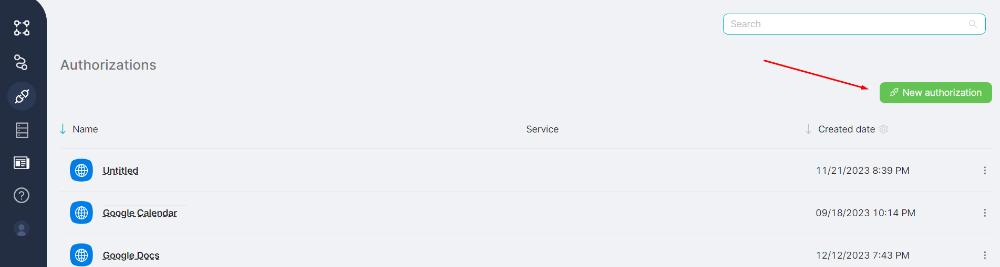

After clicking the add authorization button, you should choose the desired service from the provided list in the **Choose a service** window**.**

:::tip
💡 It is possible to add authorization after creating a node by clicking the **New authorization** button **(1)**. When adding authorization from the node, there is **no need to select a service**, it is determined automatically **(2)**.
:::

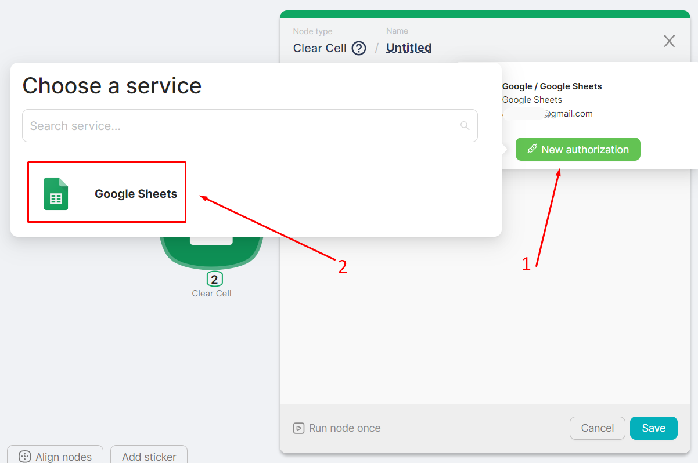

## Authorization Setup

To configure a authorization, for example, to Google Sheets, you need to:

1. Select the appropriate service in the **Choose a Service** window**:**

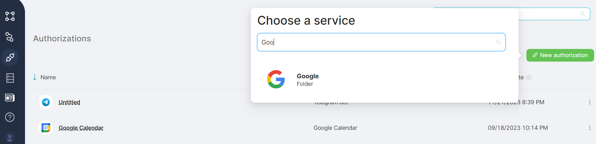

2. Choose the required authorization and click on the **Sign in with Google** button:

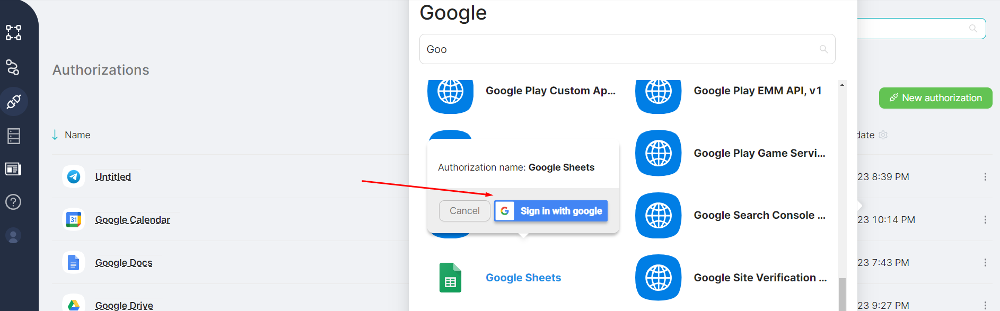

3. Authenticate using your Google account;

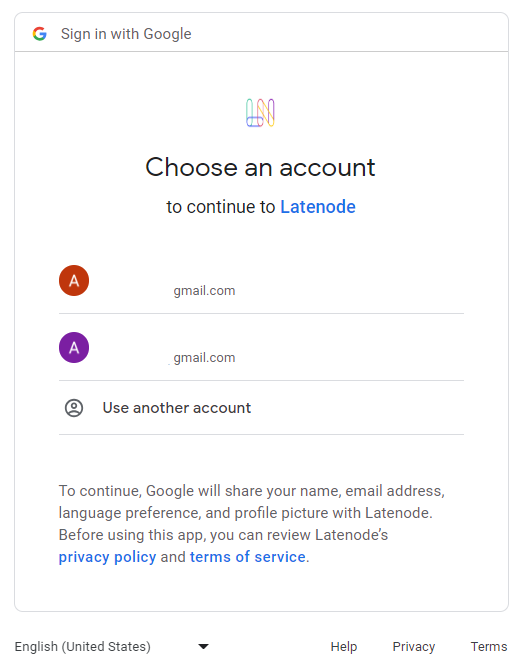

4. Confirm that you have the necessary rights for Latenode and click on the **Continue** button:

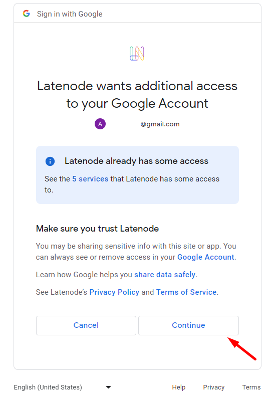

## Using the authorization

To utilize the added authorization when configuring script nodes, follow these steps: 

1. Choose and add a specialized node that corresponds to the configured authorization. For example, **Add Quick Event:**

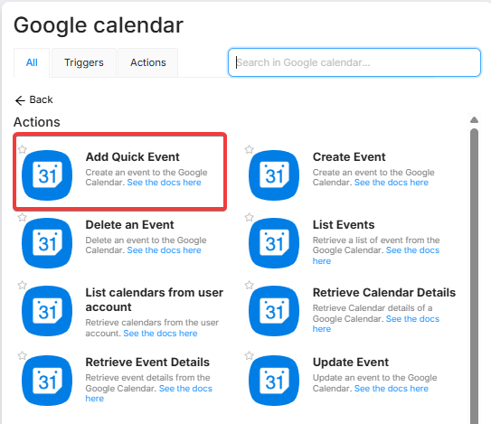

2. Click the **Create an authorization** button **(1)** and choose the corresponding authorization from the list **(2).**

:::tip
Only authorizations that correspond to the node are displayed in the list. For example, only **Google Calendar** authorizations will be displayed for **Google Calendar** group nodes.
:::

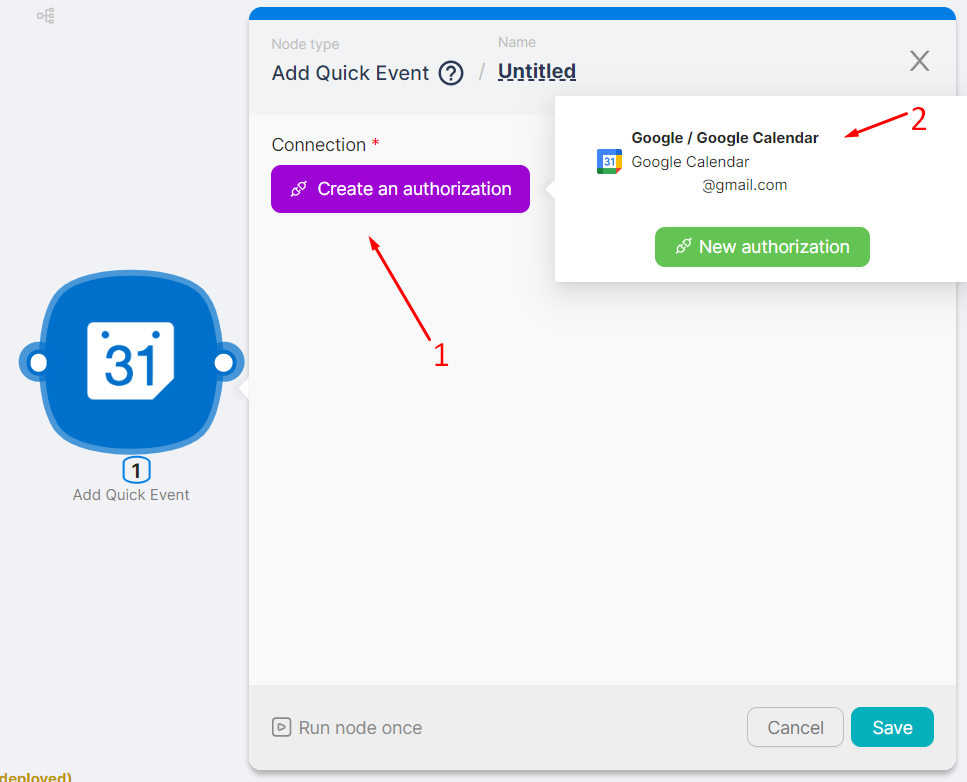

1. Review the value in the **Connection** field and fill in the other node configuration fields;

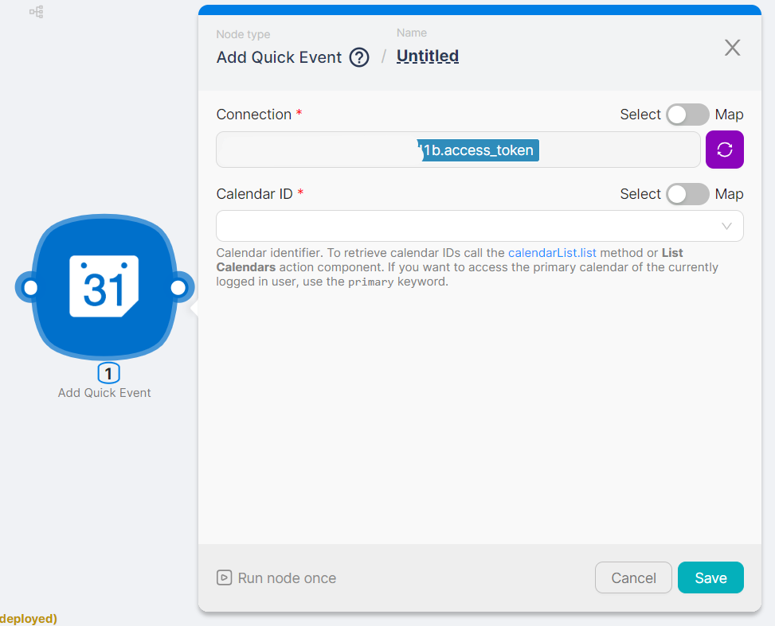

4. To modify authorization, click on the edit icon **(1)** and select a new authorization **(2)**. The current authorization is marked in blue **(3)**.

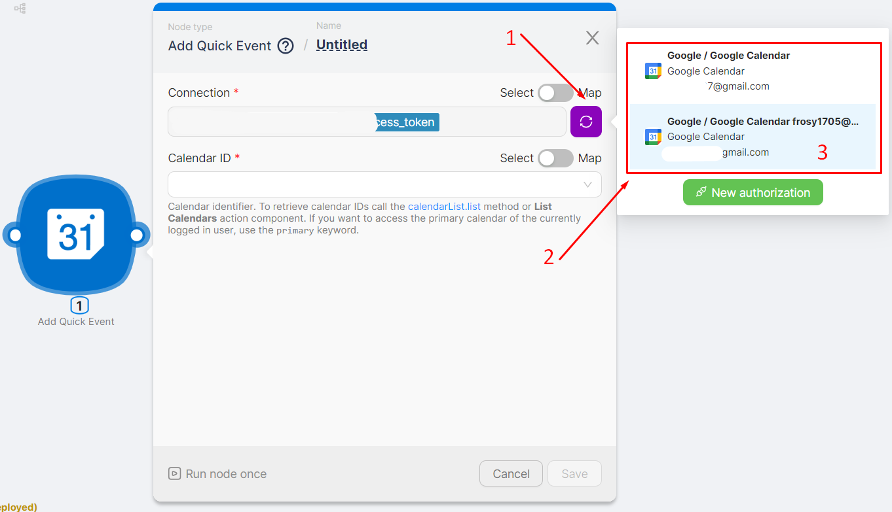

## All Authorizations

Existing authorizations are available for viewing on the **Authorizations** page**.**

You can view the main attributes of a authorization in the respective columns of the **Authorizations** table**:**

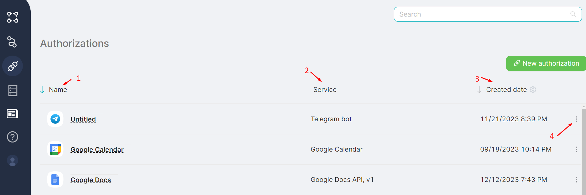

- (**1**) Authorization name - in the **Name** column. It can be edited if needed by clicking on it;
- (**2**) Service authorization - in the **Service** column. For example, Google Sheets;
- (**3**) Authorization creation Date - in the **Created Date** column. Using the gear icon, you can reconfigure the column to display the date of modification instead of the creation date;
    
    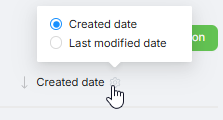
    
- Menu (**4**) available for each row and allowing you to:

**Reauthorize** if necessary;

**Delete** the authorization. 

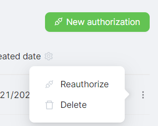

:::tip
⚠️ After clicking the **Delete** button and confirming the action in the modal window, the authorization will be permanently deleted.
:::

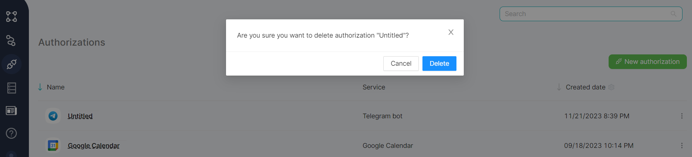

For ease of viewing and managing authorizations, a text filter is available for entering the desired authorization name.

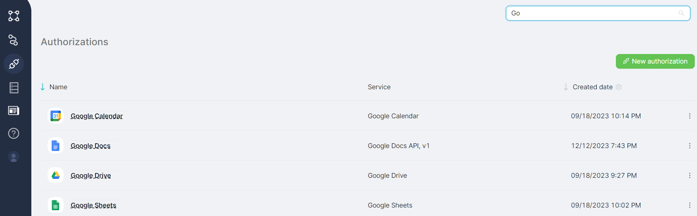
