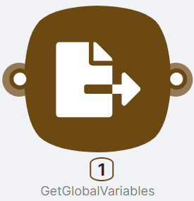
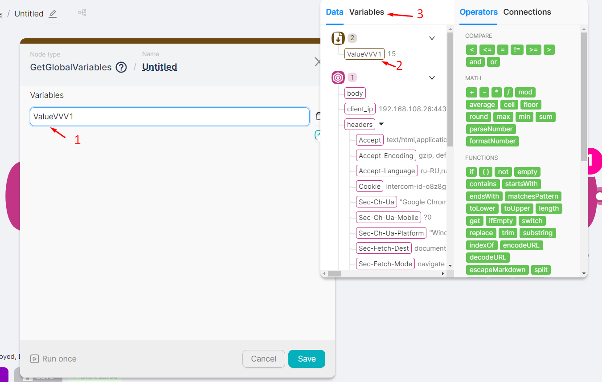

## Node Description

**GetGlobalVariables** - an action-type node, necessary for obtaining and further using a global variable set in the **SetGlobalVariables** node.

For more information about global variables, see [Global Variables](../../Advanced%20Features%2019157d45a0678082b92fec90b6ddf3c5/%F0%9F%8C%8D%20Global%20variables%2019157d45a0678180bb4de76aa71cc50f/Creating%20and%20Editing%20Variables%2019157d45a0678011a13ec9ff38aacb71.md).

## Node Configuration

To configure the **GetGlobalVariables** node, it is necessary to fill in the **Variables (1)** field with the corresponding parameter name from the previous **SetGlobalVariables (2)** node or from the list of already created global variables (displayed on the Variables tab **(3)**).

:::warning
If the global variable is being created for the first time in the scenario, a specific sequence of scenario nodes should be observed when using nodes for variable input and retrieval. The **SetGlobalVariables** node must be executed before the **GetGlobalVariables** node.
:::
