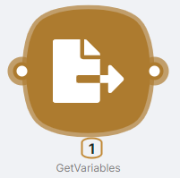

## **Node Description**

**GetVariables** - an action-type node used to retrieve and subsequently utilize a variable specified in the **SetVariables** node.

## **Node Configuration**

To configure the **GetVariables** node, you need to fill in the **Variables (1)** field with the corresponding name of the parameter from the previous **SetVariables (2)** node.

:::warning
When using nodes for variable input and retrieval, it's important to follow a specific sequence of script nodes. The **SetVariables** node should be executed before the **GetVariables** node.
:::
