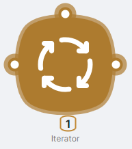
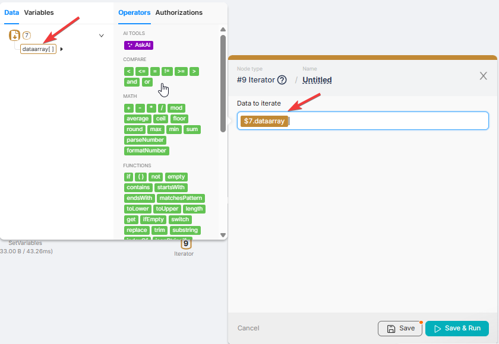

## **Node Description**

**Iterator** - an action-type node used for sequential processing of received data elements. The input parameters for the **Iterator** node can be:

- JSON objects: In this case, each Key-Value pair will participate in the iteration;
- JSON arrays: In this case, each array element will participate in the iteration.

:::tip
💡 You can watch a training video [here](https://www.youtube.com/watch?v=q5lNoPncj5g)
:::

## **Node Configuration**

To configure the **Iterator** node, you need to fill in the **Data to iterate** field. The data can be either input values or the output data and parameters from previous nodes.



The top connection point of the **Iterator** node is used to attach the node(s) whose execution will be repeated as many times as there are elements in the array or parameters. After completing the iterations, the scenario execution will continue through the right lateral connection of the **Iterator** node.

:::warning
⚠️ The node attached to the **Iterator** node via the lateral connection point will be executed only once.
:::

## Simple iterator example

```jsx
{
  "dataType": "nodes",
  "nodes": [
    {
      "id": "650459b55d9850bd9df469bc",
      "title": "",
      "description": "",
      "localId": "4",
      "typeId": "649e9700f1d01c605618af05",
      "params": [
        {
          "key": "variables",
          "type": "string_to_string",
          "value": {
            "stringToString": [
              {
                "key": "init",
                "value": "{\n    \"Table\": [\n        \"aaa\",\n        \"bbb\",\n        \"ccc\"\n    ]\n}"
              }
            ],
            "int": "0",
            "string": "",
            "text": "",
            "select": [],
            "constructorParams": [],
            "custom": "",
            "stringArray": [],
            "bool": false,
            "multiselect": []
          }
        }
      ],
      "coords": {
        "x": -145,
        "y": 9
      },
      "calculatedNodeType": {
        "id": "",
        "name": "",
        "alias": "",
        "description": "",
        "params": [
          {
            "key": "variables",
            "title": "Variables",
            "type": "string_to_string",
            "required": false,
            "description": "",
            "options": {
              "string": null,
              "int": null,
              "text": null,
              "stringToString": null,
              "select": null,
              "stringArray": null,
              "bool": null
            },
            "default": {
              "stringToString": [],
              "int": "0",
              "string": "",
              "text": "",
              "select": [],
              "constructorParams": [],
              "custom": "",
              "stringArray": [],
              "bool": false,
              "multiselect": []
            }
          }
        ],
        "systemInfo": null,
        "icon": null,
        "purposes": [],
        "isPublic": false
      },
      "alias": "set_variables"
    },
    {
      "id": "6504575f5d9850bd9df4699c",
      "title": "",
      "description": "",
      "localId": "1",
      "typeId": "62cc22317ae28c026d25692d",
      "params": [
        {
          "key": "path",
          "type": "string",
          "value": {
            "stringToString": [],
            "int": "0",
            "string": "f1cc2ddd-6f9a-413e-bbbd-dd446d1e3c5b",
            "text": "f1cc2ddd-6f9a-413e-bbbd-dd446d1e3c5b",
            "select": [],
            "constructorParams": [],
            "custom": "",
            "stringArray": [],
            "bool": false,
            "multiselect": []
          }
        }
      ],
      "coords": {
        "x": -272,
        "y": -1
      },
      "calculatedNodeType": {
        "id": "",
        "name": "",
        "alias": "",
        "description": "",
        "params": [],
        "systemInfo": null,
        "icon": null,
        "purposes": [],
        "isPublic": false
      },
      "alias": "webhook"
    },
    {
      "id": "6504575f5d9850bd9df4699d",
      "title": "",
      "description": "",
      "localId": "2",
      "typeId": "64c3aa2e17b94dc0e4b63dc0",
      "params": [
        {
          "key": "data",
          "type": "string",
          "value": {
            "stringToString": [],
            "int": "0",
            "string": "{{4.init.Table}}",
            "text": "{{4.init.Table}}",
            "select": [],
            "constructorParams": [],
            "custom": "",
            "stringArray": [],
            "bool": false,
            "multiselect": []
          }
        }
      ],
      "coords": {
        "x": -10,
        "y": 0
      },
      "calculatedNodeType": {
        "id": "",
        "name": "",
        "alias": "",
        "description": "",
        "params": [
          {
            "key": "data",
            "title": "Data to iterate",
            "type": "string",
            "required": false,
            "description": "",
            "options": {
              "string": null,
              "int": null,
              "text": null,
              "stringToString": null,
              "select": null,
              "stringArray": null,
              "bool": null
            },
            "default": {
              "stringToString": [],
              "int": "0",
              "string": "",
              "text": "",
              "select": [],
              "constructorParams": [],
              "custom": "",
              "stringArray": [],
              "bool": false,
              "multiselect": []
            }
          }
        ],
        "systemInfo": null,
        "icon": null,
        "purposes": [],
        "isPublic": false
      },
      "alias": "iterator"
    },
    {
      "id": "6504575f5d9850bd9df4699e",
      "title": "",
      "description": "",
      "localId": "3",
      "typeId": "62cc22317ae28c026d256930",
      "params": [
        {
          "key": "code",
          "type": "text",
          "value": {
            "stringToString": [],
            "int": "0",
            "string": "export default async function run({execution_id, input, data}) {\n\tconsole.log(data[\"{{2.value}}\"]);\n\treturn {\n\t\t\n\t}\n}\n",
            "text": "export default async function run({execution_id, input, data}) {\n\tconsole.log(data[\"{{2.value}}\"]);\n\treturn {\n\t\t\n\t}\n}\n",
            "select": [],
            "constructorParams": [],
            "custom": "",
            "stringArray": [],
            "bool": false,
            "multiselect": []
          }
        }
      ],
      "coords": {
        "x": 90,
        "y": -150
      },
      "calculatedNodeType": {
        "id": "",
        "name": "",
        "alias": "",
        "description": "",
        "params": [
          {
            "key": "code",
            "title": "",
            "type": "text",
            "required": false,
            "description": "",
            "options": {
              "string": null,
              "int": null,
              "text": {
                "lang": "js",
                "prefix": "",
                "suffix": "",
                "fetchOn": []
              },
              "stringToString": null,
              "select": null,
              "stringArray": null,
              "bool": null
            },
            "default": {
              "stringToString": [],
              "int": "0",
              "string": "",
              "text": "export default async function run({execution_id, input, data}) {\n\treturn {\n\t\t\n\t}\n}\n",
              "select": [],
              "constructorParams": [],
              "custom": "",
              "stringArray": [],
              "bool": false,
              "multiselect": []
            }
          }
        ],
        "systemInfo": null,
        "icon": null,
        "purposes": [],
        "isPublic": false
      },
      "alias": "js_code"
    }
  ],
  "edges": [
    {
      "id": "6504575f5d9850bd9df4699d-6504575f5d9850bd9df4699e-cycle",
      "source": "6504575f5d9850bd9df4699d",
      "target": "6504575f5d9850bd9df4699e",
      "type": "scenarioRoute",
      "sourceHandle": "cycle",
      "targetHandler": "input",
      "data": {
        "route": {
          "condition": {
            "type": "",
            "expression": {
              "value": ""
            }
          },
          "label": "",
          "nodeId": "6504575f5d9850bd9df4699e",
          "localNodeId": ""
        },
        "sourceNode": {
          "typeId": "64c3aa2e17b94dc0e4b63dc0",
          "localId": "2"
        },
        "targetNode": {
          "typeId": "62cc22317ae28c026d256930",
          "localId": "3"
        }
      },
      "selected": true
    },
    {
      "id": "6504575f5d9850bd9df4699c-650459b55d9850bd9df469bc-output",
      "source": "6504575f5d9850bd9df4699c",
      "target": "650459b55d9850bd9df469bc",
      "type": "scenarioRoute",
      "sourceHandle": "output",
      "targetHandler": "input",
      "data": {
        "route": {
          "condition": {
            "type": "",
            "expression": {
              "value": ""
            }
          },
          "label": "",
          "nodeId": "650459b55d9850bd9df469bc",
          "localNodeId": ""
        },
        "sourceNode": {
          "typeId": "62cc22317ae28c026d25692d",
          "localId": "1"
        },
        "targetNode": {
          "typeId": "649e9700f1d01c605618af05",
          "localId": "4"
        }
      },
      "selected": true
    },
    {
      "id": "650459b55d9850bd9df469bc-6504575f5d9850bd9df4699d-output",
      "source": "650459b55d9850bd9df469bc",
      "target": "6504575f5d9850bd9df4699d",
      "type": "scenarioRoute",
      "sourceHandle": "output",
      "targetHandler": "input",
      "data": {
        "route": {
          "condition": {
            "type": "",
            "expression": {
              "value": ""
            }
          },
          "label": "",
          "nodeId": "6504575f5d9850bd9df4699d",
          "localNodeId": ""
        },
        "sourceNode": {
          "typeId": "649e9700f1d01c605618af05",
          "localId": "4"
        },
        "targetNode": {
          "typeId": "64c3aa2e17b94dc0e4b63dc0",
          "localId": "2"
        }
      },
      "selected": true
    }
  ]
}
