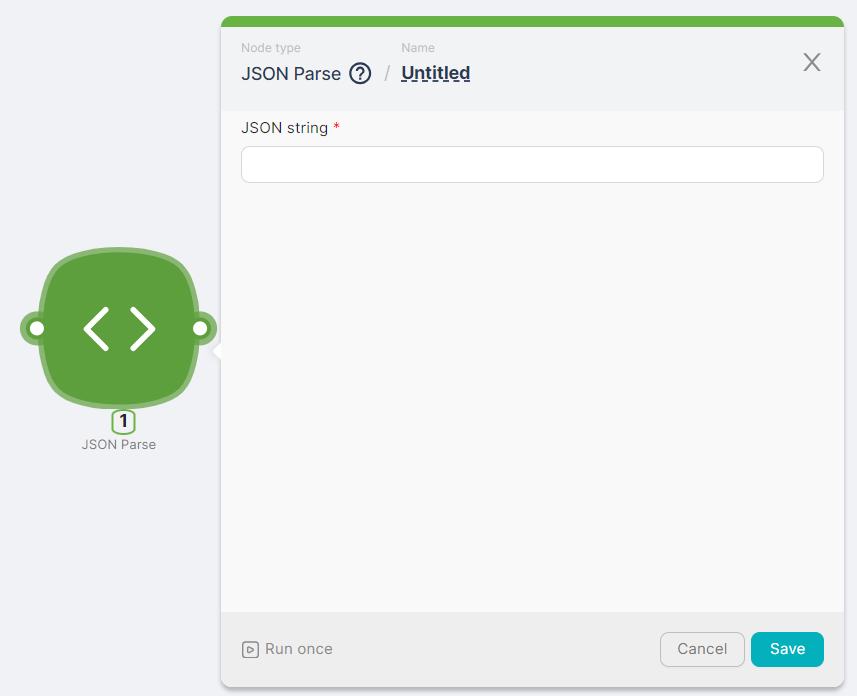
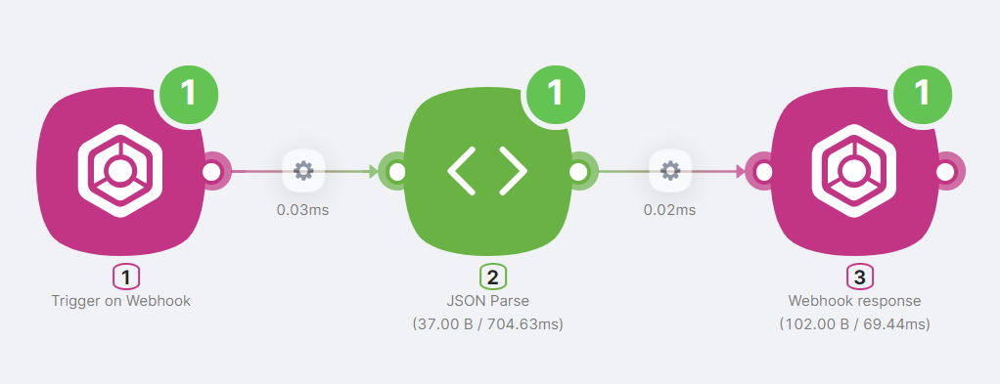
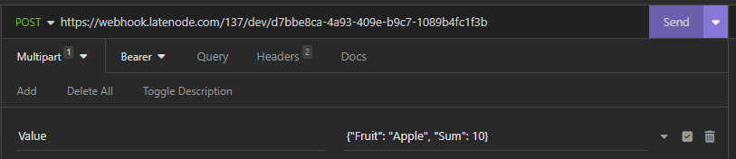
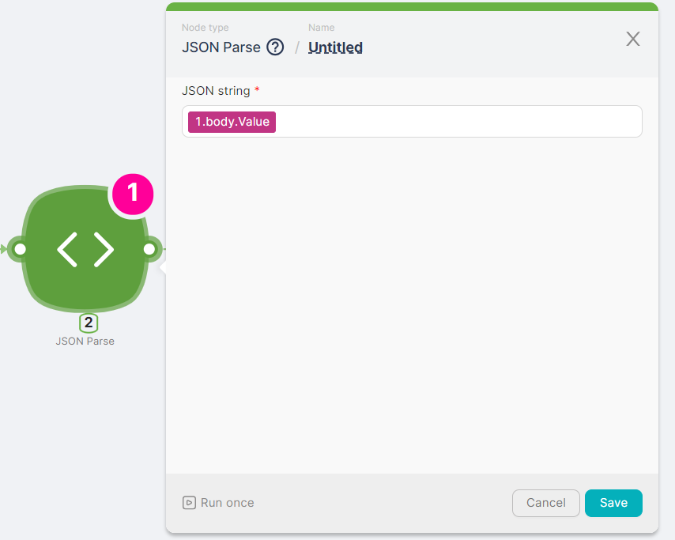
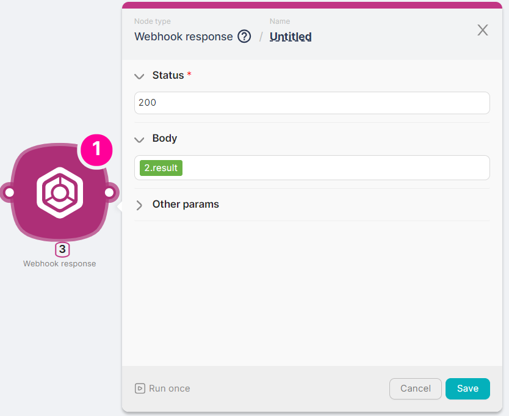
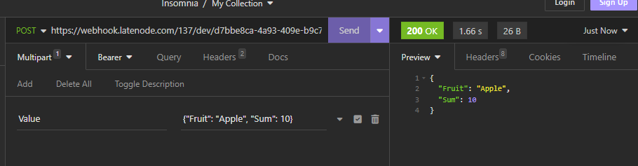

## **Node Description**

**JSON Parse** - an action-type node used for converting the provided string into JSON format.

## **Node Configuration**

To configure the JSON Parse node, it is necessary to fill in the mandatory field **JSON string**.



### **JSON string**

This field is required for entering the string that needs to be converted into JSON format.

:::tip
In the **JSON string** field, you can input text, variables from other nodes, or parameters from responses of other nodes.
:::

## **Example of Node Usage**

To obtain a string converted to JSON format, you need to create a scenario with nodes: 



1. **Trigger on Webhook** node is used to trigger the scenario and pass the string `{"Fruit": "Apple", "Sum": 10}` into it;



2. **JSON string** node is used to perform the conversion of the string;



3. **Webhook response** node is used to receive the result of the string conversion.



The result of executing this scenario is a JSON object.



### JSON

```jsx
{
	"Fruit": "Apple",
	"Sum": 10
}
