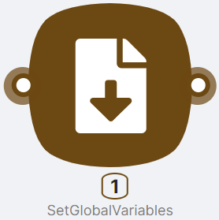
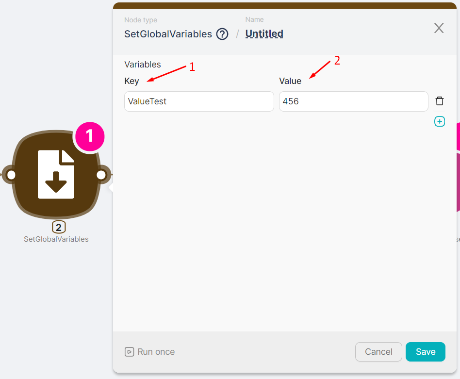
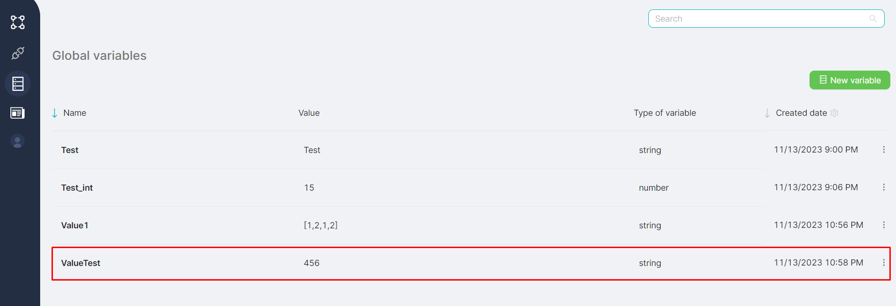
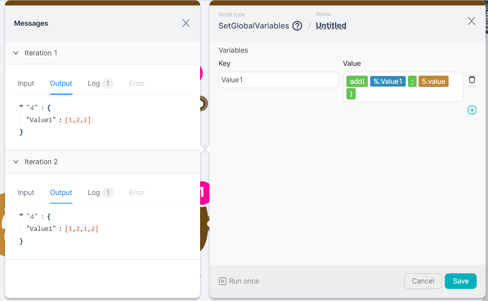

# SetGlobalVariables

Article Description: Managing persistent global variables across workflows.
Published: Yes
Suggested: No

## Node Description

**SetGlobalVariables -** an action-type node necessary for introducing a new global variable into the scenario. The added variable can subsequently be used in any account scenario.

<aside>
💡 The added global variable can be modified during the execution of nodes. If two **SetGlobalVariables** nodes are placed consecutively and both define the value of the same variable, the final value for the variable will be set by the last **SetGlobalVariables** node**.**

</aside>

For more information about global variables, see [Global Variables](../../Advanced%20Features%2019157d45a0678082b92fec90b6ddf3c5/%F0%9F%8C%8D%20Global%20variables%2019157d45a0678180bb4de76aa71cc50f/Creating%20and%20Editing%20Variables%2019157d45a0678011a13ec9ff38aacb71.md).

## Node Configuration

To configure the **SetGlobalVariables** node, it is necessary to fill in key-value pairs.

- **(1)** **Key** - a field for entering the name of the global variable;
- **(2) Value** -  a field for entering the value of the global variable.

After creation using the **SetGlobalVariables** node, the global variable will be displayed in the table of all existing global variables.

If the **SetGlobalVariables** node is connected to a node through the top Iterator connection point and is executed multiple times sequentially, the node's output data is displayed with an indication of Iterations. Each iteration corresponds to its output data.

