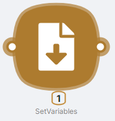
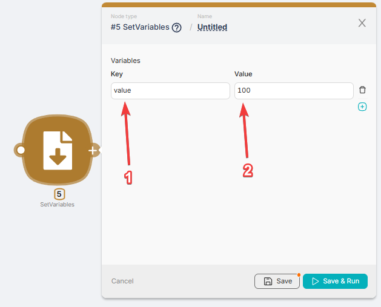
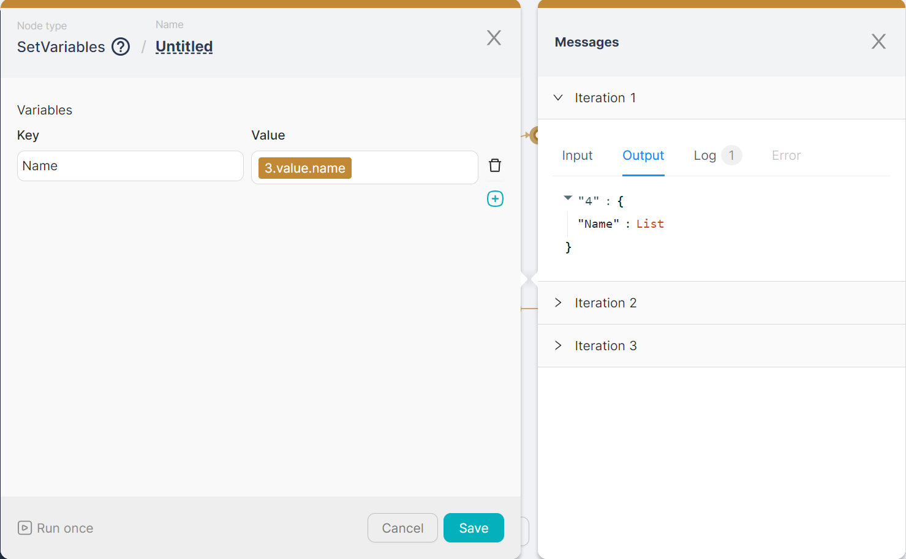

## **Node Description**

**SetVariables** - an action-type node used to introduce a new variable into the script. The added variable can be subsequently used within the script.

See [Example scenario using SetVariables and the add operator](../../Examples%20&%20Tutorials%201c257d45a06780a9886cf7408c3a350e/%F0%9F%93%9D%20Scenario%20Examples%2019157d45a0678101a860c354d339b123/Using%20SetVariables%20node%20and%20the%20add%20operator%2019157d45a06780fdb9eafe03d5b22af2.md)

:::tip
The added variable is unique within the script and can be changed during the execution of script nodes. If two **SetVariables** nodes are placed in sequence and both define the value of the same variable, the final value for the variable will be set by the last **SetVariables** node.
:::

## **Node Configuration**

To configure the **SetVariables** node, you need to fill in pairs of Key-Value fields.

- **(1) Key** - the field for entering the variable name;  
- **(2) Value** - the field for entering the variable's value.  

If a **SetVariables** node is connected to an **Iterator** node and is executed multiple times sequentially, the node's output is displayed with an indication of **Iterations**. Each iteration corresponds to its own output data.

