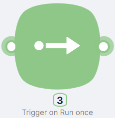

## Node Description

**Trigger on Run once** is a trigger-type node that allows manually starting a scenario by clicking the **Run once** button. Unlike other triggers, it does not require external requests or specific events to activate. The node allows passing input parameters (text or files) into the scenario.

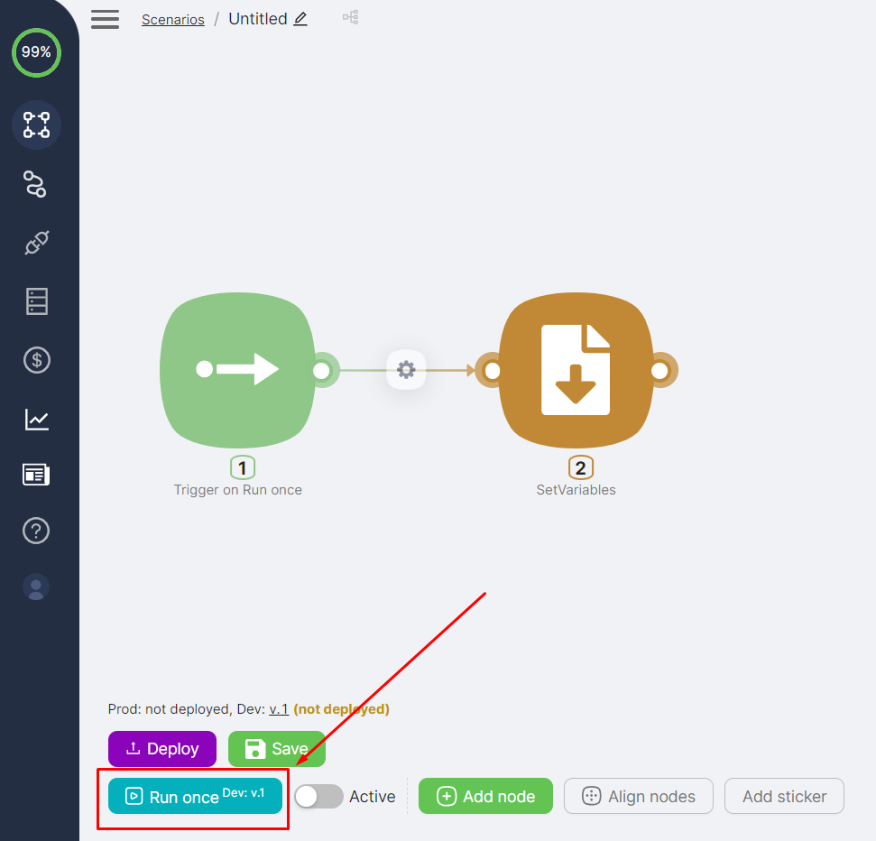

## **Example of Node Usage**

### **Example 1: Processing Text with JavaScript**

In this example, the user inputs text, the scenario processes it using JavaScript, and the result is stored as a variable.

### **Scenario Structure**

1. **Trigger on Run once** – Starts the scenario manually and receives text input.
2. **JavaScript** – Processes the text (e.g., converts to uppercase or counts words).

### **Scenario Setup**

#### **1. Configuring the Trigger on Run Once Node**

* Click on the **Trigger on Run once** node.
* In the **Params** section, add a text parameter.
* Specify a name for the variable (e.g., `input_text`).
* Enter a sample text value for testing.

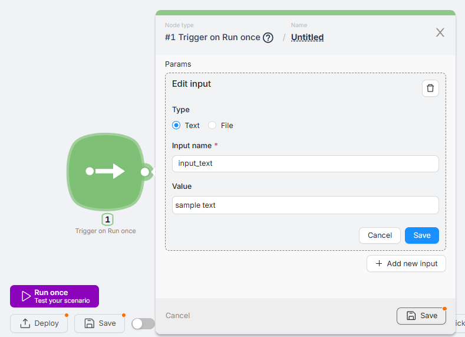

* Click **Save** and **Run once** to pass the data into the scenario.

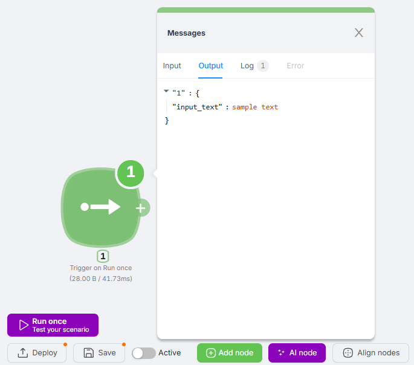

#### **2. Processing Data with JavaScript**

Add a **JavaScript** node and insert the following code, then press **Generate params**:

```jsx
/** @CustomParams
{
  "text": {
    "key": "text",
    "title": "Text",
    "description": "Text to convert to uppercase",
    "type": "string"
  }
}
*/
export default async function run({ data }) {
  const { text } = data;

  // Validate the input text
  if (!text) {
    throw new Error('The text parameter is required.');
  }

  const upperCaseText = text.toUpperCase();

  return { upperCaseText };
}
```

* Pass the input variable containing text.

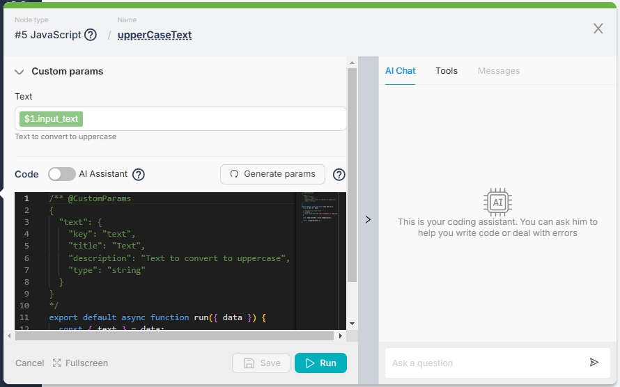

* Run the scenario.
* The output will be the formatted text.

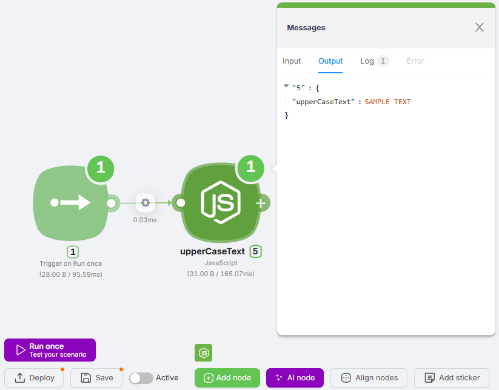

---

### **Example 2: Recognizing Image Content Using AI**

In this example, an image is uploaded and sent to an AI service for content recognition.

### **Scenario Structure**

1. **Trigger on Run once** – Starts the scenario manually and allows image upload.
2. **AI Image Processing** – Sends the image to an AI service for recognition.

### **Scenario Setup**

#### **1. Configuring the Trigger on Run Once Node**

* Click on the **Trigger on Run once** node.
* In the **Params** section, add a **File** parameter.
* Specify a name for the variable (e.g., `input_image`).

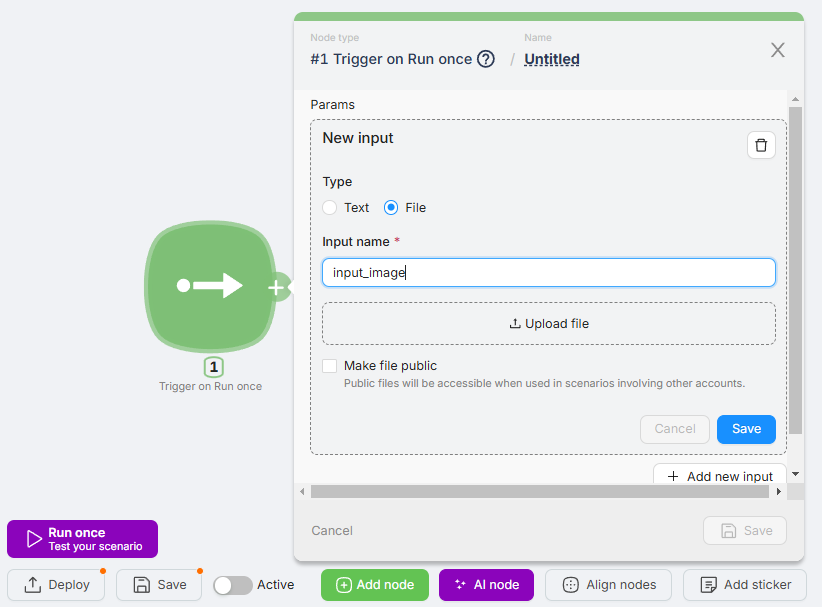

* Upload a sample image for testing.

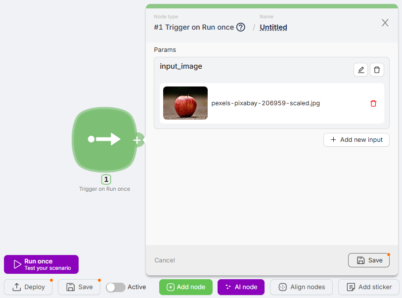

* Click **Save** and **Run once** to pass the data into the scenario.

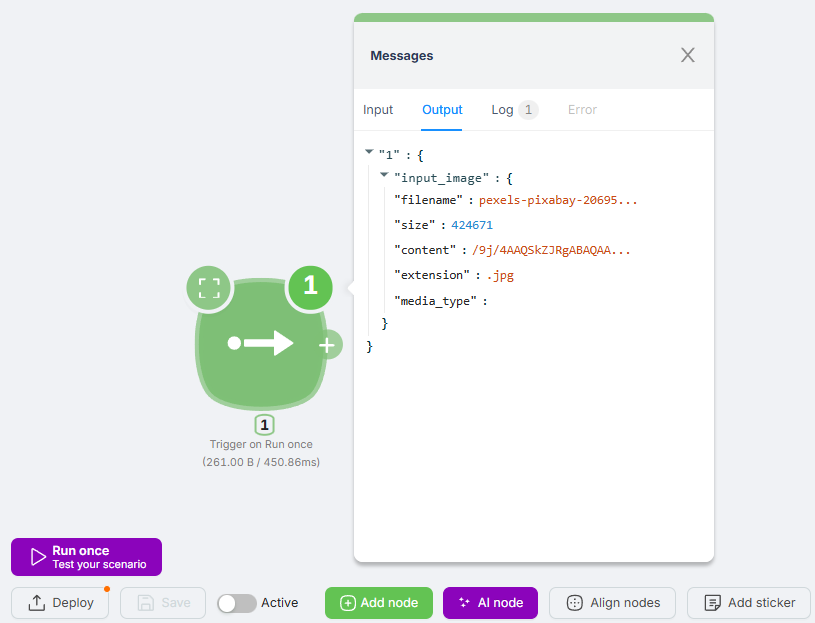

#### **2. Sending the Image to AI for Analysis**

* Add an AI-based image recognition node (e.g., GPT or another service).

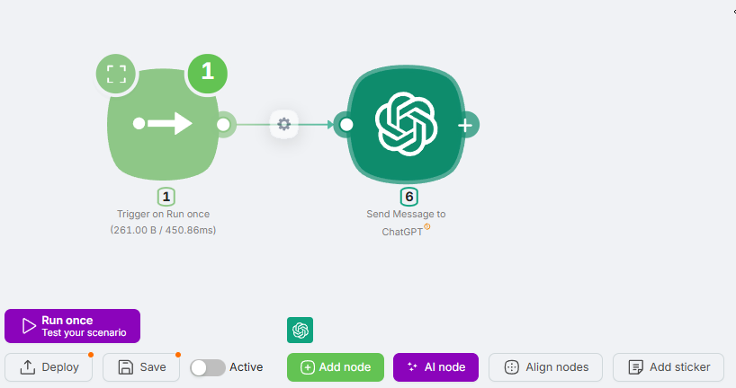

* Pass the **file content**, **filename**, and **prompt for analysis** into the corresponding fields.

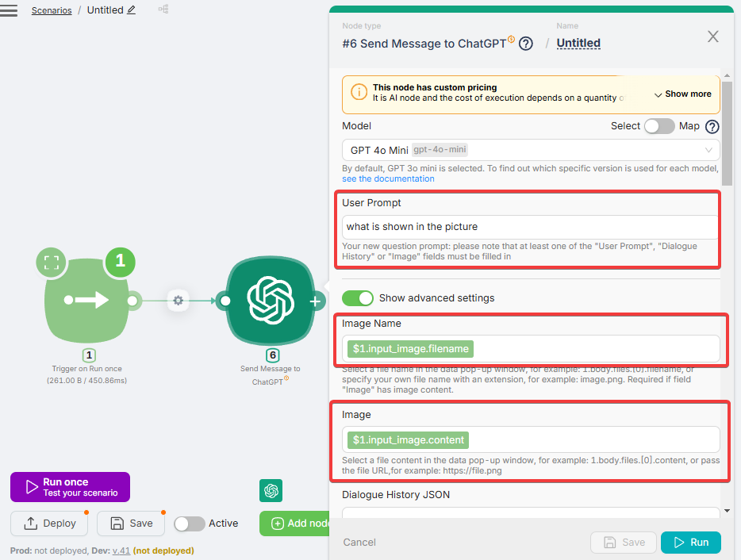

* Run the scenario to receive the recognized result.

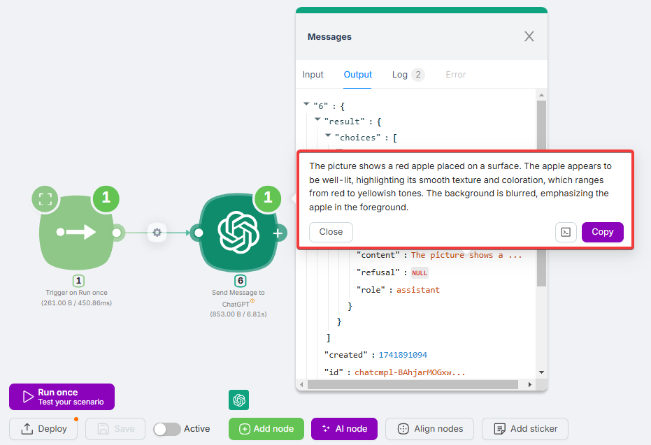

---

### **Node Behavior on Execution**

* The **first** execution stores the processed values.
* Subsequent executions overwrite previous values.
* Uploaded files are processed and passed into the scenario with metadata.

These examples demonstrate how the **Trigger on Run once** node can be used to process text and file data within automated workflows while saving results for later use.
