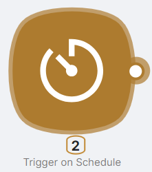
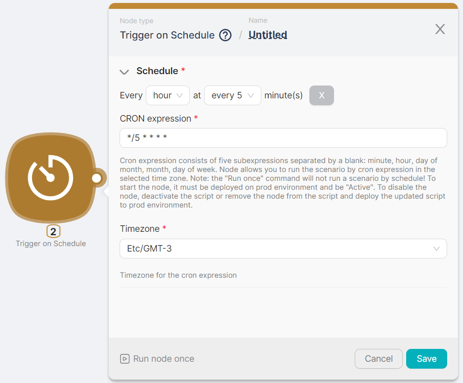
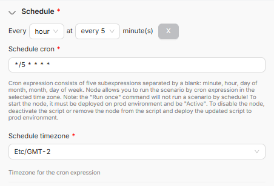

# Trigger on Schedule

Article Description: Automating actions based on predefined time intervals.
Published: Yes
Suggested: No

## **Node Description**

**Trigger on Schedule -** a trigger-type node, used to initiate a script based on a schedul.

## **Node Configuration**

To configure the **Trigger on Schedule** node, you need to fill in the mandatory fields.

### Schedule

This field is necessary for setting up a schedule. Using мdropdown menus, configure the frequency for: 

- Year;
- Month;
- Day of the month;
- Day of the week;
- Hours;
- Minutes.

You don't need to fill in all the listed time parameters; it's sufficient to fill in only those parameters that will provide the desired schedule.

<aside>
💡 The CRON expression field is automatically populated in accordance with the configured parameters.

</aside>

<aside>
⚠️ The scenario will operate based on the corresponding CRON expression if the scenario itself is **active** and deployed in the **Production** branch.

To disable the scenario from running on a schedule, you can either set it to an inactive state (**Paused** status) using the **Activity** toggle or remove the **Trigger on Schedule** node from the scenario.

</aside>

### Timezone

This is the field for selecting the timezone in which you want to configure the schedule.
