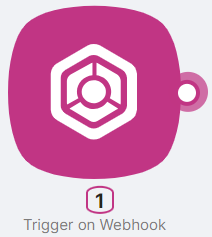
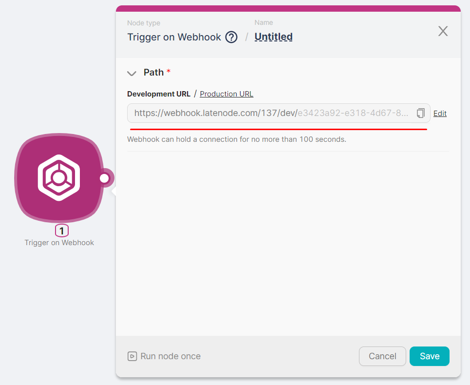
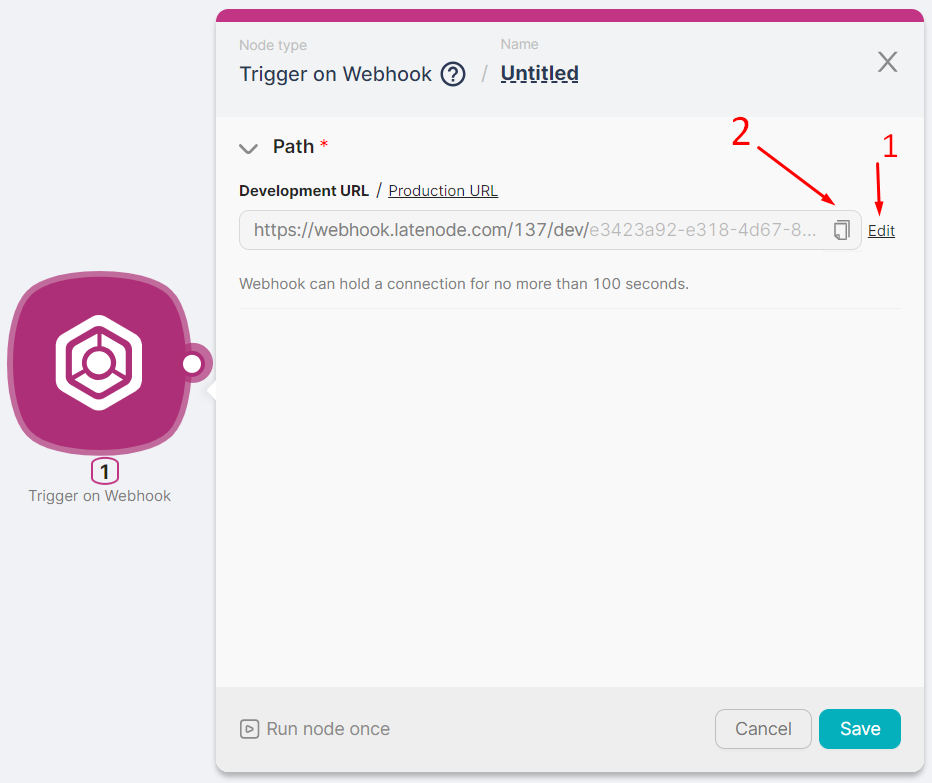

## **Node Description**

**Trigger on Webhook** is a trigger node type that serves as the entry point into the scenario. Requests are sent to the URL of the **Trigger on Webhook** node, initiating the execution of the scenario.

## **Node Configuration** 

After adding the **Trigger on Webhook** node, two versions of its URL are automatically generated. Both URL versions are displayed in the **Path** field:

- The **Production-version** is accessible by clicking the **Production URL**. Sending requests to this URL version can be continuous, and the scenario execution will not stop until the scenario is manually halted or a critical error occurs.;
- The **Development-version** is accessible by clicking the **Development URL**. Sending a request to this URL version runs the scenario once, after which the scenario stops its operation. This is useful for testing and debugging the scenario temporarily without prolonged execution.

The generated URL can be either partially modified (**1**) or copied (**2**), for later inclusion in the request sent to trigger the scenario.

:::tip
💡 You can send requests to the **Trigger on Webhook** node's address using the **POST** method (if data needs to be transmitted to the node) or the **GET** method (if a simple node triggering is required).
:::

*building js code is failed: Node build fatal error*
