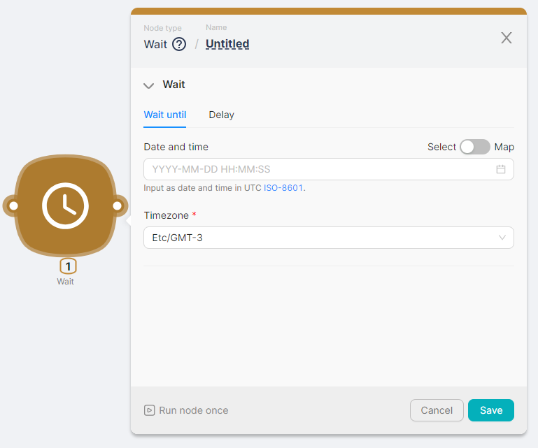
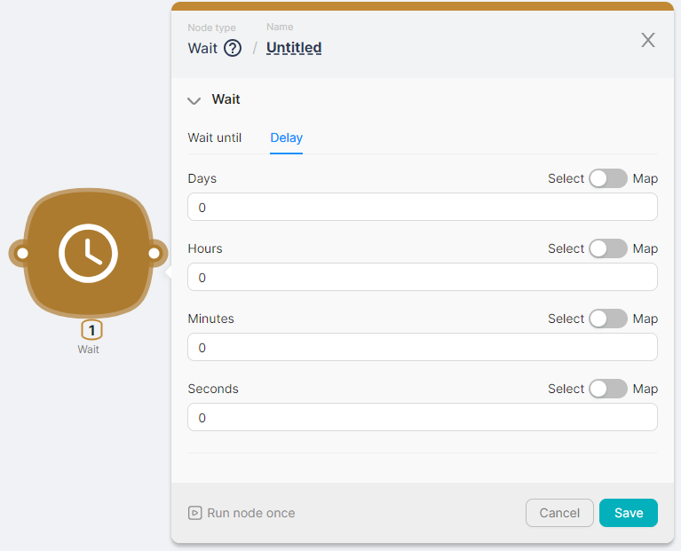

## Node Description

**Wait** - an action-type node necessary for introducing a pause during scenario execution using: 

- setting a delay time, for example, 30 minutes;
- setting a specific time until which the wait is required, for example, 2024-01-01T00:00:00Z.

:::tip
The **Wait** node can be placed between scenario nodes. This allows for a temporal gap in the execution of scenario nodes before the **Wait** node and those after the **Wait** node.  
See **[the example of using the Wait node](../../Examples%20&%20Tutorials%201c257d45a06780a9886cf7408c3a350e/%F0%9F%93%9D%20Scenario%20Examples%2019157d45a0678101a860c354d339b123/Using%20a%20Wait%20node%2019157d45a06780be94e4d49463fa5871.md)**
:::

## Node Configuration

To configure the Wait node, it is necessary to fill in the required or optional fields in one of the two tabs: **Wait until** or **Delay.**

### **Wait until**

The **Wait until** tab is necessary for setting the time until which one must wait before executing the scenario nodes that follow the **Wait** node. Configuration is done using the fields:

- **Date and Time** - a field for selecting the date and time in the [ISO-8601](https://en.wikipedia.org/wiki/ISO_8601) format when the scenario nodes following the **Wait** node should be executed.
- **Timezone** (mandatory field) - a field for selecting the timezone according to which the pause should be set.

### **Delay**

The **Delay** tab is necessary for setting the waiting period after which the scenario nodes following the **Wait** node should be executed. Configuration is done using the fields:

- **Days** - a field for selecting the number of days in the waiting period;
- **Hours** - a field for selecting the number of hours in the waiting period;
- **Minutes** - a field for selecting the number of minutes in the waiting period;
- **Seconds** - a field for selecting the number of seconds in the waiting period.

When calculating the waiting time, the values entered in the fields are summed up. For example, the waiting time will be 1 day, 4 hours, 32 minutes, and 59 seconds if the field values are: 

- **Days** - 1;
- **Hours** - 4;
- **Minutes** - 32;
- **Seconds** - 59.

