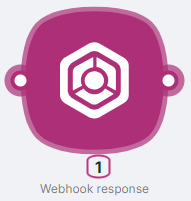
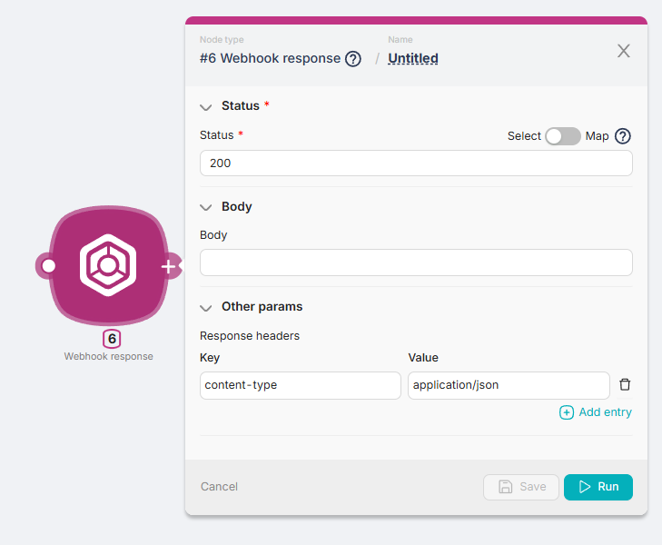
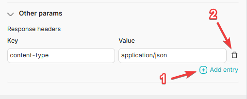

# Webhook response

Article Description: Handling responses from webhooks in workflows.
Published: Yes
Suggested: No

## **Node Description**

**Webhook Response** is an action node that generates a response to a request sent to the **Trigger on Webhook** node.

## **Node Configuration**

To configure the **Webhook Response** node, you need to fill in both required and optional fields.

The only required***** field is:

- **Status**.

### Status

This field is used to input the response code to the request from the previous node. For example, a response code like 200.

### Body

The response field generated by the **Webhook Response** node when it receives a response code from the **Status** field of the previous node. 

<aside>
💡 In the **Body** field, you can input text, variables from other nodes, or response parameters from other nodes.

</aside>

### Other Params

A section of fields for filling in response headers: 

- **Key** - a field to enter additional information about the response, such as the format, e.g., **content-type;**
- **Value** - a field to enter the value of additional information about the response, such as the format value, e.g., **application/json.**

To add a new Key-Value pair, you can use the **Add a header** button (**1**). To remove a Key-Value pair, you can use the **Remove** button (**2**).  

