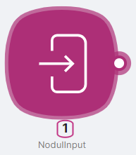
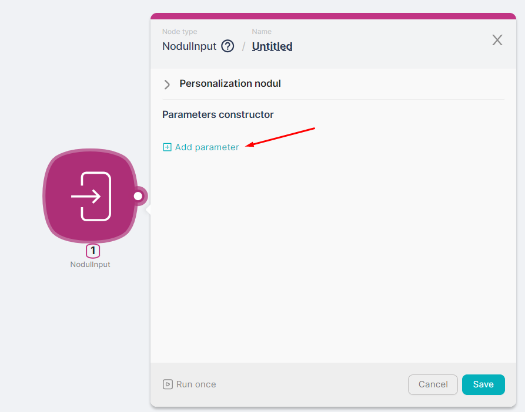
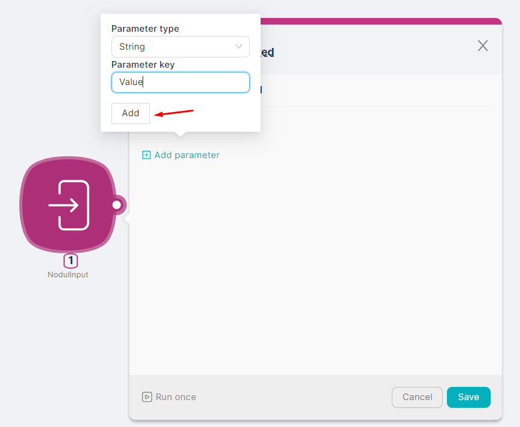
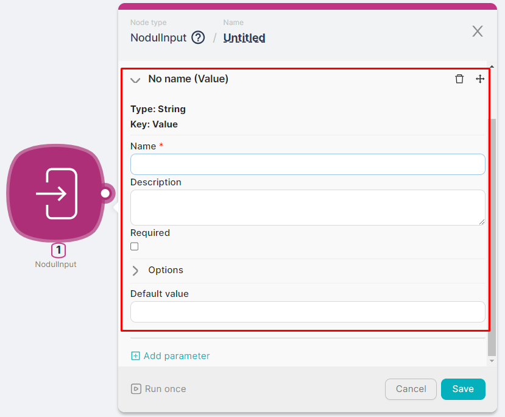
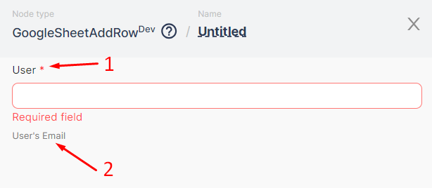
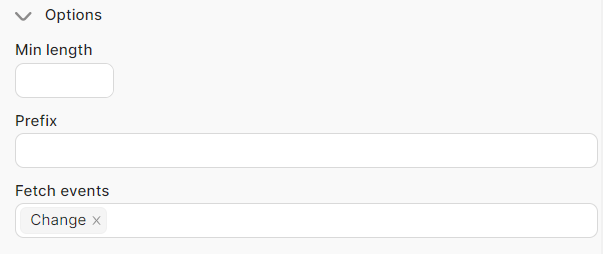
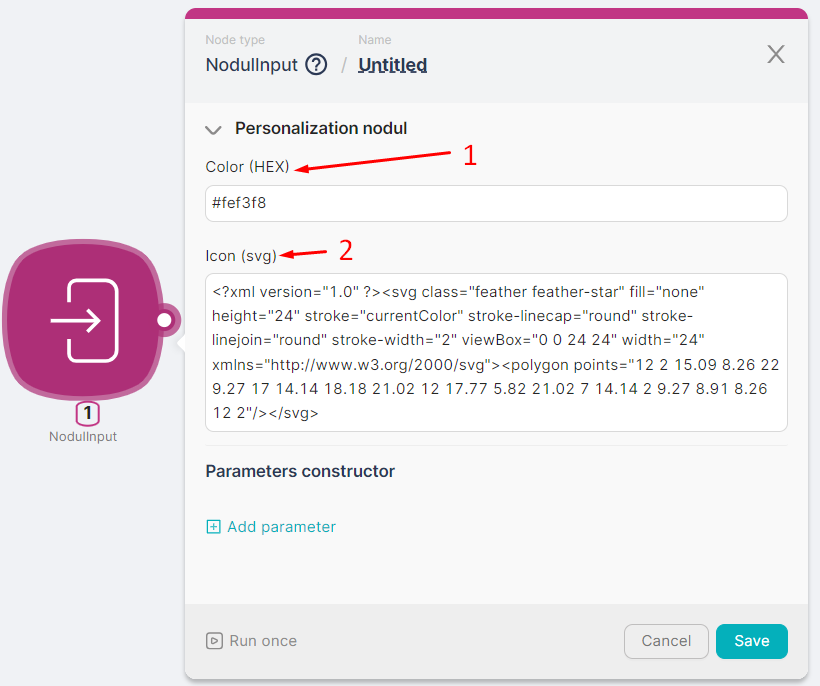

## **Node Description**

**NodulInput** - a node of the action type, necessary for creating a scenario of the **Nodul** type. This node serves as an entry point into the **Nodul** type scenario and defines the form of the scenario node, i.e., its parameters.

<aside>
💡 See [Utilizing the NodulInput node to create a scenario of the Nodul type](How%20to%20create%20your%20own%20nodes%2019e57d45a067802d94caed9118a7d080.md)

</aside>

## **Node Configuration**

To configure the **NodulInput** node, it is necessary to fill in optional fields, including the creation of node parameters.

### Parameter Constructor

Adding parameters to the node is available by clicking the **Add parameter** button.

When adding a parameter, it is necessary to specify the **Parameter type** (e.g., string) and the **Parameter key** (e.g., Value) and then click the **Add** button.

After adding the parameter, it is necessary to define its **Name** in the respective field and, if needed, fill in optional parameters:

- Determine the requirement attribute by checking the **Required (1)** checkbox;
- Add a description of the parameter in the **Description (2)** field for subsequent tooltip display;

- Add a value in the **Default Value** field to display it in the parameter field when the node is initially opened.

### Parameter Constructor. Options

In the **Options** section, you can define additional characteristics of the parameter:

- **Min length** - the minimum allowable number of characters in the parameter's value. If the character count is less than this, the parameter will be highlighted;
- **Prefix;**
- **Fetch events** - the need to update the node's form when selecting a parameter value:

If **Change** is selected, the node's form will be updated every time the parameter is reselected.

If **Init** is selected, the node's form will be updated during the initial parameter input.

If both **Change** and **Init** are selected, the node's form will be updated every time the parameter is reselected and during the initial node opening.

### Personalization of Nodul

A scenario of the **Nodul** type, created using the **NodulInput** node, is displayed in the list of all nodes after pressing the add node buttons.

The icon of such a scenario can be personalized by filling in the fields of the **NodulInput** node:

- **Color (HEX) (1)** - color representation in HEX format;
- **Icon (svg)** **(2)** - icon representation in svg format.

