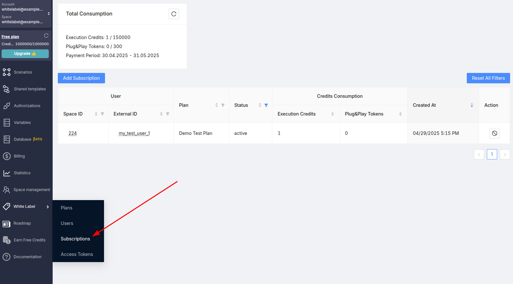
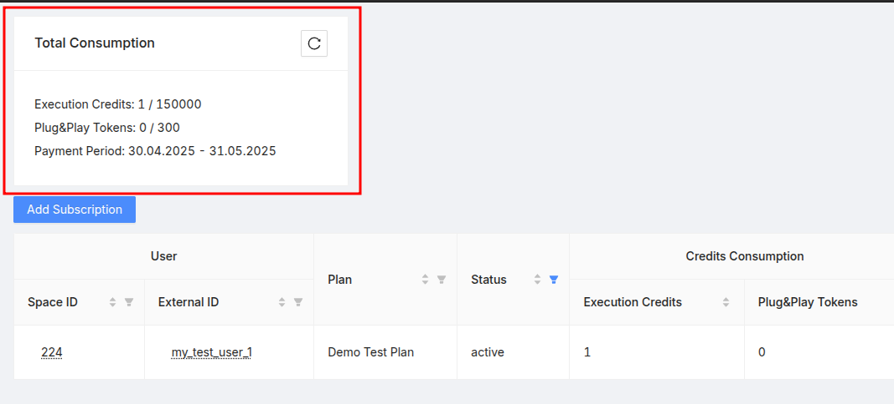
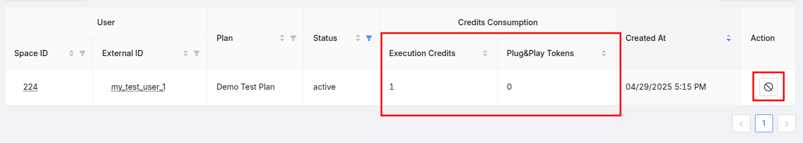
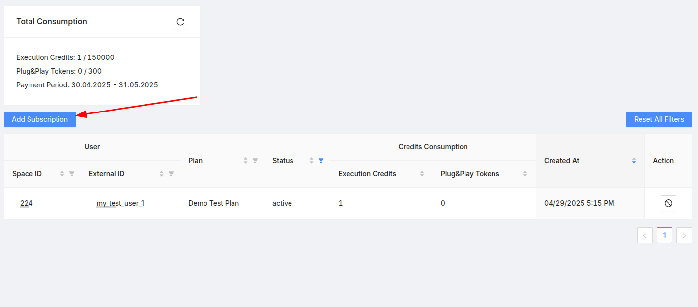
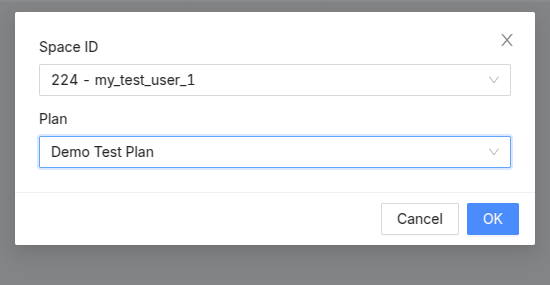
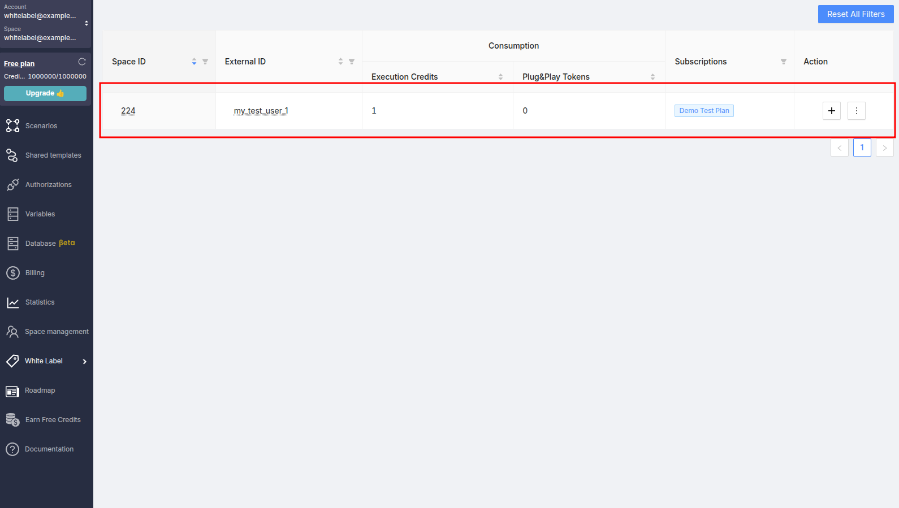

# Administration

This article describes the user authorization process for your organization and capabilities of the administrator panel within the Latenode platform.

## Requirements

To follow the steps described below, you must already have a White Label administrator account on the Latenode platform, as well as a secret key for signing JWT tokens.

## Creating Custom Subscription Plans

Before you begin authorizing users from your organization within the Latenode platform, you need to create at least one subscription plan that will be automatically assigned to new users.

Initially, your organization will be provided with defined maximum and minimum values for various characteristics that can be configured for each plan. These characteristics are referred to as quotas.

List of configurable characteristics and quotas for your organization:

- **Execution Microcredits**

  A 1 platform credit equals 1 million microcredits. Depending on the minimum execution fee (see corresponding section), users may spend less than 1 credit per scenario execution.

- **Plug&Play Microtokens**

  1 token equals 1 million microtokens. Used for Plug&Play nodes (e.g., AI nodes without connection setup), as well as for some integrations.

- **Active Scenarios Limit**
- **Parallel Executions Limit**
- **Min Execution Charging Period (Microseconds)**

  1 second equals 1 million microseconds. By default, 1 credit (1 million microcredits) is charged for every 30 seconds of scenario execution. You can reduce the charging interval. For example, setting it to “3000000” will charge 0.1 credit (or 100,000 microcredits) every 3 seconds of execution.

- **AI Assistant Requests Limit**
- **Connected Accounts Limit**
- **Minimum Trigger Interval (Seconds)**
- **Execution History Availability Period (Minutes)**

<iframe
  src="https://app.arcade.software/share/BCAAvZfetsHHgBzDsxaX"
  width="100%"
  height="600"
  frameBorder="0"
  allowFullScreen
></iframe>

### Creating a Plan

To create a plan:

1. Log in to the administrator dashboard using your username and password
2. Go to the "White Label" → "Plans" section
3. Click the "Create Plan" button
4. Fill in the plan name, its quotas, and click the "OK" button

:::tip[Tip]
After clicking the "OK" button, a new entry will appear in the plans table.  
You will need the ID of the created plan later. Its value can be found in the "ID" column.
:::

Below is an interactive video showing how to create a plan.

<iframe
  src="https://app.arcade.software/share/1z23Oq8QAglI8kmnWUOp"
  width="100%"
  height="600"
  frameBorder="0"
  allowFullScreen
></iframe>

## Subscription Management and Resource Usage Monitoring

To view the list of existing subscriptions, go to the “Subscriptions” section:

Here, you can see total credit and plug&play token usage for the current billing period:

You’ll also see a table of usage per subscription for each user, with an option to cancel subscriptions:

To add a subscription for a user, click the “Add Subscription” button:

In the modal window, select the user and the subscription plan to assign:

## Managing the User List

To view the user list, go to the “Users” section. On this page, you can see the list of users along with their assigned subscriptions. The subscription assignment functionality is also available here:

:::tip[Tip]
Users are not limited in the number of subscriptions.  
When a user has more than one subscription, the best quotas will be applied.
:::
