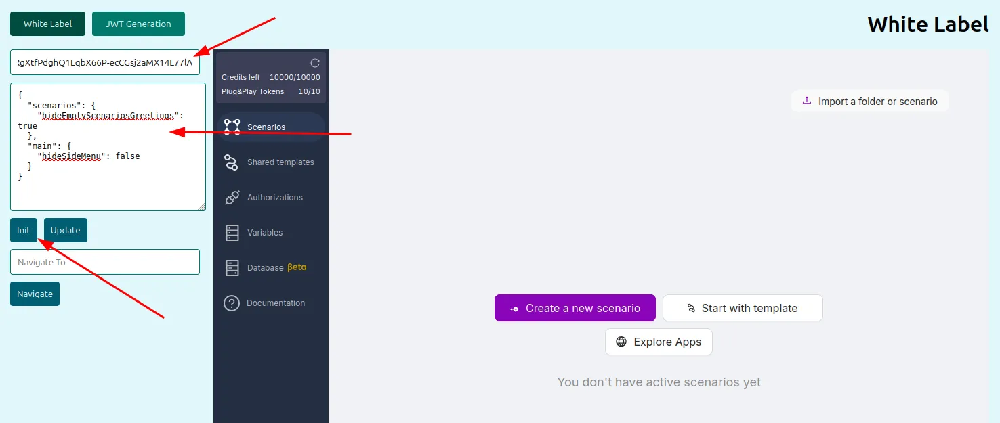

## User Authorization in the Platform

A [sandbox repository](https://github.com/garkavenko-latenode/whitelabel-example) is available for testing user authorization. You can find setup instructions in the repository's [README.md](http://README.md).

### Token Generation

1. After launching the sandbox, open the "JWT Generation" section. This section helps you generate a JWT token for a user in your organization. You can use this token to authorize the user in the embedded mode of the Latenode platform.
2. Paste your private key into the “Private Key” input field and select the signing algorithm corresponding to your key pair.
3. Fill in the Tenant ID, User ID, and Plan ID fields, where:
    
    `Tenant ID` – Required. Your tenant ID in the Latenode platform
    
    `User ID` – Required. A unique string that clearly identifies the user in your organization
    
    `Plan ID` – Optional. The ID of the subscription plan to be assigned to the user during their first login. For future logins, this field is not required. In this example, the created plan ID is “35”
    
4. Click the “Generate Token” button to create a new JWT token, which you can copy using the “Copy” button. 


:::tip
Token generation is done locally without network requests. This ensures your private key is not sent to the Latenode platform or any third parties.
:::

Below is an interactive video showing token generation
<iframe 
  src="https://app.arcade.software/share/euGSV7RHF9Z9KI5NWXgo" 
  width="100%" 
  height="600" 
  frameBorder="0" 
  allowFullScreen
></iframe>

### Using token

Once the JWT token is generated, go to the “White Label” section. Paste the copied value into the “JWT Token” field. In the “UI Config JSON” field, insert the following:

```json
{
  "scenarios": {
    "hideEmptyScenariosGreetings": true
  },
  "main": {
    "hideSideMenu": false
  }
}

```
 
Then click the “Init” button. After that, an embedded version of the Latenode platform will appear on the right side of the screen, with the new user already authorized, in this case with ID = `tu_2` 


